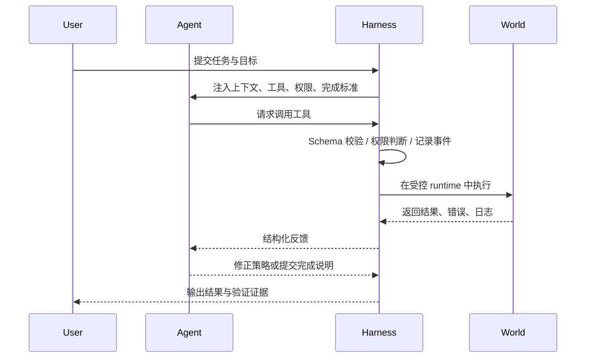

# Agent 与 Harness 的边界

Agent 和 Harness 的边界，是 Agent 系统能否稳定的关键。

Agent 负责行动中的判断。它要解释任务、读取上下文、制定下一步、选择工具、理解结果、修正策略、总结进展。它像一个局部控制器，负责在当前状态下决定下一步怎么做。

Harness 负责行动制度。它定义目标和完成标准，提供上下文，暴露工具，检查权限，保存状态，管理记忆，运行验证，调度多 Agent，处理生命周期和恢复。

如果这个边界模糊，系统会出现典型失败。让 Agent 自己决定完成标准，它可能倾向于乐观宣布完成；让 Agent 自己管理权限，它可能在任务压力下绕过风险边界；让 Agent 自己决定记忆写入，它可能把临时信息写成长期事实；让 Agent 自己评估全部结果，它可能把文本上看起来合理误认为真实成功。

Claude Code 的设计把权限、工具执行和 Hook 放在系统层，说明 Agent 不应直接拥有所有行动权。HiClaw 把凭证管理交给 Higress，而不是交给 Worker。DeerFlow 把执行环境放进沙盒和虚拟路径映射。Hermes 限制子 Agent 使用敏感工具。这些都是边界设计。

Agent 可以参与判断，但 Harness 必须掌握制度。这个边界不是为了削弱 Agent，而是为了让 Agent 的能力可以被信任地释放。

## SVG 图解：职责边界


这张图把边界分成三块：Agent、Harness 和真实世界。Agent 负责理解与判断，Harness 负责制度化控制，真实世界负责产生后果与反馈。可靠系统不会让 Agent 直接越过 Harness 操作真实世界。

## Mermaid 图解：一次行动的职责归属



## 代码示例：边界由 Harness 强制

```python
def run_agent_tool(agent_request, tool_registry, permission_checker, runtime):
    tool = tool_registry.get(agent_request.tool_name)
    args = tool.input_model.model_validate(agent_request.arguments)

    # Agent 只能提出请求，不能绕过权限直接执行。
    decision = permission_checker.decide(tool=tool, args=args)
    if decision.status == "deny":
        return {"ok": False, "summary": decision.reason}
    if decision.status == "needs_approval":
        return {"ok": False, "summary": "waiting for human approval"}

    return runtime.execute(tool, args)
```

这个片段表达的是边界设计：Agent 发起意图，Harness 决定是否执行。
