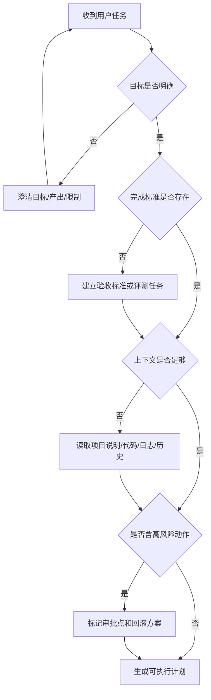

# 任务理解：Agent 的第一职责不是动手，而是定界

Agent 接到任务后的第一职责，不是马上调用工具，也不是马上写代码，而是定界。

定界包括几个问题：用户真正要什么，完成标准是什么，工作目录在哪里，哪些系统可以动，哪些动作高风险，哪些信息缺失，是否需要澄清。

工程任务尤其需要这一步。用户说“修一下 bug”，Agent 如果不先确认错误现象、复现路径、相关模块和验证入口，就很容易做局部猜测。用户说“优化系统”，Agent 如果不确认优化指标，可能把性能、UI、架构、文案、成本混在一起。

已有文章中多次强调 SPEC 的重要性，就是因为 SPEC 能把模糊意图转成任务边界。AGENTS.md、CLAUDE.md、任务看板、评测任务、验收标准，也都是帮助 Agent 定界的材料。

定界不是拖延，而是减少错误行动。一个没有定界的 Agent 越勤奋，越可能扩大影响面。一个定界清楚的 Agent，反而可以更快进入有效行动。

因此，成熟 Agent 应该具备“先问边界”的能力：如果目标不清，澄清；如果目标清楚但上下文不足，调查；如果动作高风险，请求审批；如果完成标准不存在，先帮助用户建立标准。

## 流程图：任务理解到任务定界



## 项目化任务规格示例

下面是一个可被 Agent 消费的任务规格。它比“优化一下系统”更适合进入 Harness。

```yaml
task:
  id: fix-login-timeout
  goal: 修复登录接口偶发 504
  scope:
    include:
      - backend/auth
      - backend/gateway
    exclude:
      - database/schema
      - frontend
  acceptance:
    - pytest tests/auth/test_login_timeout.py passes
    - gateway health check returns 200
    - no public API response shape changes
  risk:
    requires_approval:
      - database migration
      - production config write
  evidence_required:
    - changed_files
    - test_command
    - test_result
    - remaining_risk
```

这种结构化任务定义把目标、范围、风险和证据要求前置，能显著降低 Agent 误解任务的概率。
