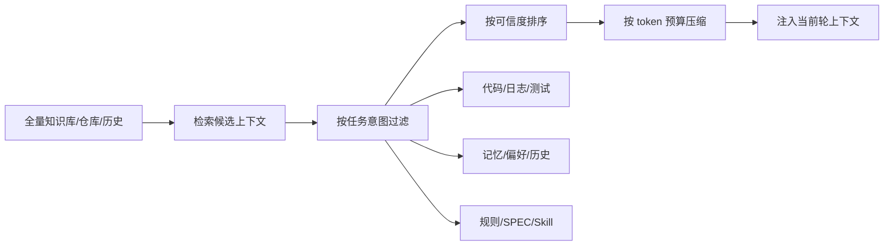

# 上下文读取：Agent 要学会“看什么”，而不是“看全部”

Agent 的上下文读取职责，不是把所有资料吞进去，而是判断当前决策需要什么。

上下文有很多类型：项目说明、代码文件、历史记忆、任务文档、SPEC、工具输出、评测结果、外部知识、用户偏好、日志、截图。不同信息的可信度、生命周期和用途不同。Agent 如果不区分，就会把临时日志当规则，把旧记忆当事实，把猜测当结论。

例如，做 bug 修复时，Agent 应优先读取错误日志、复现步骤、相关代码和测试入口；做架构分析时，应优先读取入口、模块边界、调用链和配置；做自动评测时，应优先读取评测目标、步骤和预期结果；做长期任务恢复时，应优先读取任务状态、已修改文件、验证结果和未解决问题。

OpenHarness 的 Memory 和 Skill，Hermes 的 SessionDB，DeerFlow 的 MemoryMiddleware，HiClaw 的 MinIO 状态外置，都在帮助 Agent 获得上下文。但最终在某一轮决策中，Agent 仍要判断哪些上下文相关。

上下文读取还有一个重要边界：Agent 不能盲信记忆。记忆是提示，不是事实。关键结论必须回到代码、测试、日志或用户确认上验证。

因此，Agent 的上下文能力，不是“读得多”，而是“读得准”。Harness 负责让上下文可发现、可检索、可压缩；Agent 负责选择和解释。

## 图解：上下文选择漏斗



## 代码示例：上下文包结构

一个可靠 Agent 不应只拿到一段拼接文本，而应拿到带来源和生命周期的上下文包。

```python
context_packet = {
    "task": {
        "goal": "修复登录接口偶发 504",
        "acceptance": ["targeted test passes", "gateway health check passes"],
    },
    "stable_rules": [
        {"source": "AGENTS.md", "text": "Do not change public API shape without approval."}
    ],
    "working_state": {
        "changed_files": ["backend/auth/session.py"],
        "last_test": "failed: timeout still reproduced",
    },
    "retrieved_evidence": [
        {"source": "logs/auth-2026-04-30.log", "summary": "upstream token service p95 latency spike"},
        {"source": "backend/gateway/retry.py", "summary": "retry policy excludes auth route"},
    ],
    "memory_hints": [
        {"type": "team_preference", "text": "Prefer explicit timeout config over hard-coded constants."}
    ],
}
```

这里的关键是分层：规则、状态、证据、记忆不能混成一个长 prompt。Agent 需要知道每条信息来自哪里、可信度如何、生命周期多长。
