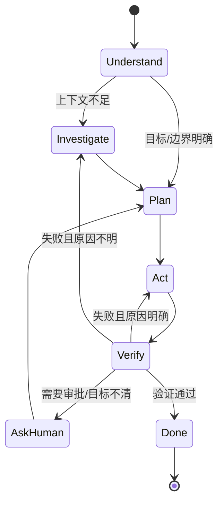
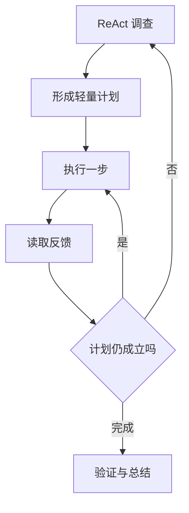
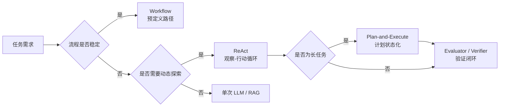

# 计划与行动：Agent 要动态推进，而不是一次性幻想完整路径

Agent 需要计划，但计划不等于一次性写完所有步骤。真实任务中，很多信息只有行动后才出现：测试失败、权限不足、依赖缺失、接口异常、用户补充要求、子 Agent 返回不完整。

因此，Agent 的计划应该是动态计划。它要能根据反馈调整路径，而不是死守初始方案。

一个成熟 Agent 在计划时应区分几类动作：立即可做的动作、需要先调查的动作、必须验证的动作、需要用户批准的动作、可以委派给子 Agent 的动作、遇到反馈后需要重估的动作。

Claude Code 的 Query Loop、OpenHarness 的 QueryEngine、HermesAgentLoop、DeerFlow 的 LangGraph 工作流，都说明 Agent 的运行不是单轮回答，而是持续状态推进。每一轮都可能改变计划。

动态计划还要求 Agent 保持任务状态。它要知道已经做了什么、为什么做、结果如何、下一步是什么。否则上下文一压缩，计划就会断裂。

计划的价值不是让 Agent 显得有条理，而是降低盲动。好的计划能暴露依赖、风险和验证点；坏的计划只是装饰性清单。

## 状态机图：计划不是清单，而是循环



## 代码示例：任务计划中的状态约束

```json
{
  "task_id": "fix-login-timeout",
  "steps": [
    {"id": 1, "name": "read logs and failing test", "status": "done"},
    {"id": 2, "name": "inspect auth retry policy", "status": "in_progress"},
    {"id": 3, "name": "patch retry config", "status": "pending"},
    {"id": 4, "name": "run targeted and gateway tests", "status": "pending"}
  ],
  "constraints": {
    "max_in_progress": 1,
    "must_verify_before_done": true,
    "approval_required_for": ["database migration", "production config write"]
  }
}
```

这种计划比自然语言清单更适合 Harness，因为系统可以检查 `max_in_progress`、验证状态和审批点。

## ReAct 与 Plan-and-Execute 的取舍

单 Agent 的行动模式大体可以分为 ReAct 和 Plan-and-Execute。

ReAct 的优点是灵活。ReAct 原论文的核心是把 reasoning trace 和 action 交错起来：推理负责维护计划、更新假设和处理异常，行动负责访问工具、知识库或外部环境来获得新证据。Agent 每一轮根据观察决定下一步，适合调试、探索、网页操作、信息检索这类路径不确定的任务。它的问题是容易陷入局部循环：看到一个错误，改一次，再看到相似错误，再改一次，但没有重新审视假设。

Plan-and-Execute 的优点是全局结构更清楚。LangChain 对这一模式的工程解释是：planner 先产出步骤，executor 再针对每个步骤决定工具或行动。这样 planner 可以专注高层任务分解，executor 专注局部执行。它适合长任务、跨文件修改、多阶段迁移。它的问题是调用成本更高，而且计划可能建立在不充分调查上，导致后面执行一连串错误步骤。

更实用的做法是混合：

1. 先用 ReAct 式调查收集关键事实。
2. 再生成轻量计划。
3. 执行每一步时继续用 ReAct 读取反馈。
4. 计划失效时显式重规划。



这也是工程 Agent 的常见实际形态：不是一开始幻想完整方案，也不是一直无计划试错，而是在探索和计划之间切换。

## 来源补充：从论文模式到工程模式

ReAct、Plan-and-Execute、Evaluator-Optimizer 不是互斥流派，而是不同粒度的控制结构。

| 模式 | 控制粒度 | 适合任务 | Harness 约束 |
|---|---|---|---|
| ReAct | 单步观察-行动循环 | 调试、搜索、网页操作、故障诊断 | 最大轮次、循环检测、工具返回摘要 |
| Plan-and-Execute | 任务级规划 + 步骤级执行 | 长任务、跨模块变更、多阶段迁移 | 计划状态、步骤验证、失效重规划 |
| Evaluator-Optimizer | 生成-评估-修正循环 | 质量关键输出、代码生成、文档润色 | 明确评分标准、迭代上限、人工兜底 |
| Workflow | 预定义路径 | 稳定业务流程、审批、ETL、客服分流 | 节点输入输出 schema、失败分支 |

Anthropic 对 workflow 和 agent 的区分可以作为设计边界：如果路径可以稳定预定义，优先 workflow；只有当任务步骤无法提前确定，并且模型需要根据环境反馈动态控制过程时，才升级为 Agent。


