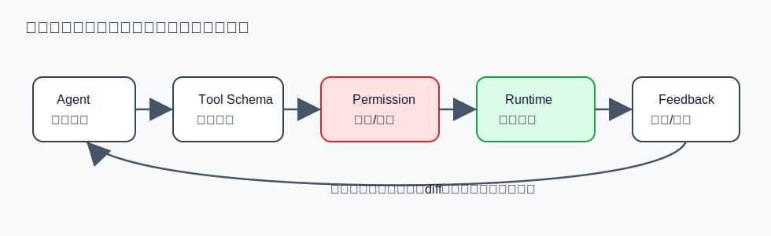
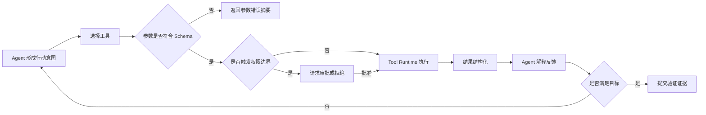

# 工具调用：Agent 的行动能力，也是主要风险源

工具调用让 Agent 从语言进入现实。读文件、写代码、执行命令、浏览网页、调用 API、发送消息、运行测试，都是通过工具完成的。

Agent 在工具调用中的职责包括：选择正确工具，填写参数，理解返回，根据失败调整策略，避免机械重试。

但工具调用不是简单函数调用。模型容易被工具名字误导，也容易误填参数。工具描述如果没有说明使用场景，Agent 会把相近工具混用；错误信息如果太长，Agent 会抓不住重点；权限边界如果缺失，Agent 可能执行危险动作。

因此，Agent 使用工具时必须遵循证据意识。工具结果不是噪声，而是现实反馈。命令退出码、测试失败、HTTP 状态、文件 diff、截图、日志摘要，都应影响下一轮判断。

同时，高风险工具不能只靠 Agent 自觉。Claude Code 的权限系统、Hermes 对子 Agent 的工具限制、DeerFlow 的沙盒、HiClaw 的 Higress 网关，都说明工具能力必须由 Harness 管理。

Agent 的工具调用能力越强，Harness 对工具的 schema、权限、日志和错误摘要要求越高。否则工具不是增强能力，而是放大风险。

## 图解：工具调用管线



这个图的重点是：Agent 发出的不是“直接执行命令”，而是“行动意图”。意图必须经过工具 schema 校验、权限检查和运行时隔离，最后才进入真实世界。执行结果也不是简单返回文本，而要形成下一轮可用的反馈证据。



## 代码示例：工具定义不只是函数

OpenHarness 一类系统通常会把工具定义成“输入模型 + 执行函数 + 权限语义”。下面是简化示例，表达的是工具设计原则，不是某个项目的逐字源码。

```python
from pydantic import BaseModel, Field


class ReadFileInput(BaseModel):
    path: str = Field(description="Workspace-relative file path")
    start_line: int | None = Field(default=None, ge=1)
    limit: int = Field(default=200, ge=1, le=1000)


class ToolResult(BaseModel):
    ok: bool
    summary: str
    content: str | None = None
    error_type: str | None = None


class ReadFileTool:
    name = "read_file"
    risk = "read_only"
    when_to_use = "Use when the agent needs exact local file evidence."
    when_not_to_use = "Do not use for broad discovery; use search first."

    def run(self, args: ReadFileInput, workspace) -> ToolResult:
        path = workspace.resolve_inside(args.path)
        text = path.read_text(encoding="utf-8")
        lines = text.splitlines()
        start = (args.start_line or 1) - 1
        chunk = lines[start : start + args.limit]
        return ToolResult(
            ok=True,
            summary=f"Read {len(chunk)} lines from {args.path}",
            content="\n".join(chunk),
        )
```

这个例子里，真正重要的不是 `read_text`，而是几个边界：

- `path` 必须在 workspace 内解析，避免越界读取。
- 输入有类型和范围约束，减少模型误填参数。
- 结果有 `summary`，便于下一轮推理。
- 工具有 `when_to_use / when_not_to_use`，帮助 Agent 做选择。

如果工具只是一个自由文本命令入口，Agent 会把大量判断都压在模型临场发挥上；如果工具本身带 schema、风险级别和摘要，Harness 就能把错误前置、把反馈结构化。
