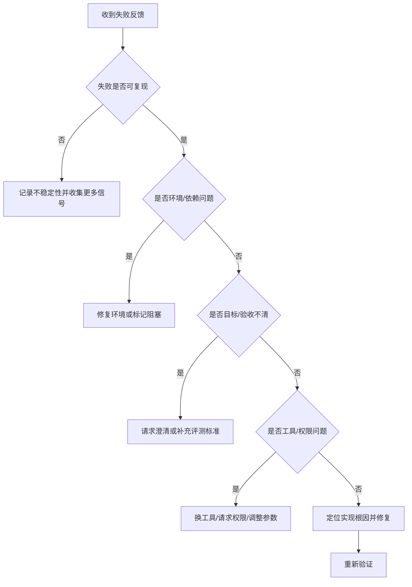

# 反馈解释：Agent 真正的能力体现在失败之后

Agent 是否可靠，往往不是看第一次是否成功，而是看失败后如何处理。

反馈可能来自编译错误、单测失败、lint、日志、UI 截图、用户否定、评测分数、另一个 Agent 的任务通知。Agent 的职责是把这些反馈解释成下一步行动，而不是简单重试。

它需要做几类区分：环境失败还是实现失败，症状还是根因，权限不足还是参数错误，上下文缺失还是推理错误，目标不清还是执行不对。

例如，测试失败不一定说明刚改的代码错了，也可能是依赖没安装；网页抓取失败不一定说明内容不存在，也可能是登录态或反爬；子 Agent 说完成不一定可信，还需要证据和产物。

很多 Agent 的低质量行为表现为“重复同一路径”。同一个补丁改三次仍失败，说明 Agent 没有解释反馈，只是在局部搜索。成熟 Agent 应在重复失败后重新检查假设、读取更多上下文或请求帮助。

Harness 可以通过错误摘要、Loop Detection、验证脚本和事件流帮助 Agent 理解反馈。但最终，Agent 要把反馈转化为策略调整。

## 决策树：反馈解释



## 结构化反馈示例

```json
{
  "check": "pytest tests/auth/test_login_timeout.py",
  "status": "failed",
  "failure_kind": "assertion",
  "expected": "login returns within 2s",
  "actual": "gateway timeout after 10s",
  "key_evidence": [
    "TokenServiceClient.request has no timeout",
    "gateway retry excludes /auth/login"
  ],
  "suggested_next_step": "inspect token client timeout and retry policy"
}
```

这种反馈比原始日志更适合 Agent，因为它把“哪里失败、为什么可能失败、下一步看哪里”明确表达出来。
