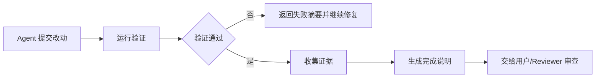

# 验证与完成声明：Agent 不能自封完成

Agent 很容易在语言上收束任务：“已经完成”“问题已修复”“系统已优化”。但工程系统不能把语言收束当成真实完成。

Agent 的职责不是自封完成，而是提交完成证据。它应该说明做了哪些改动，运行了哪些验证，哪些验证通过，哪些没有运行，为什么没有运行，还有哪些风险或限制，是否需要人工复核。

完成标准应来自 Harness、任务文档、评测平台或人类，而不是 Agent 临场决定。

自动评测平台把这个原则表达得很清楚：评测任务定义目标，评测集定义步骤和预期结果，Agent 的优化必须回到评测结果。没有评测信号，Agent 只能猜；有评测信号，Agent 才能收敛。

在代码任务里，总验证脚本也承担这个角色。它把“完成”从主观判断变成可运行检查。测试通过可以静默，测试失败则把错误返回给 Agent 修复。

因此，Agent 的完成声明应是一份审计记录，而不是一句结论。越是高风险任务，越要强调验证证据。

## 完成声明模板

```markdown
## 完成说明

目标：修复登录接口偶发 504。

改动：
- `backend/auth/session.py`：为 token service 调用添加显式 timeout。
- `tests/auth/test_login_timeout.py`：新增延迟场景回归测试。

验证：
- `pytest tests/auth/test_login_timeout.py`：通过。
- `pytest tests/auth`：通过。

未验证：
- 未跑全量 E2E，原因：本地缺少浏览器依赖。

风险：
- token service 超时时间目前为配置项默认值 2s，生产环境可能需要按 p95 调整。
```

## Mermaid 图：从验证到完成报告


