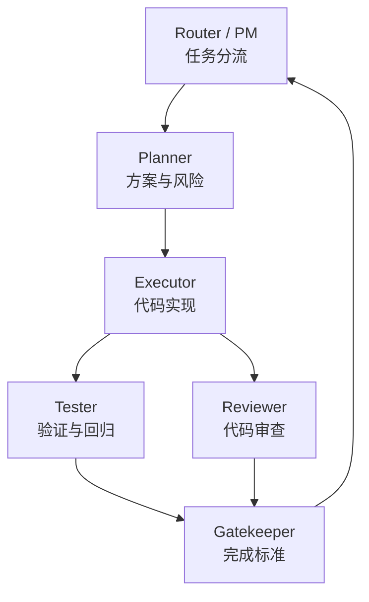
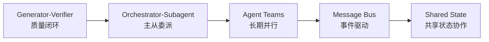
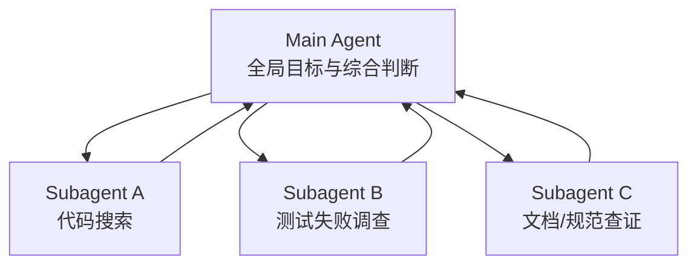
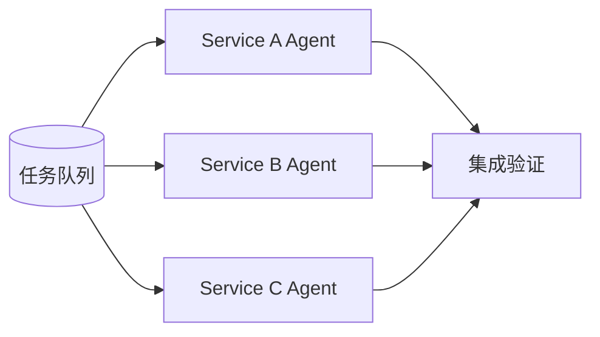
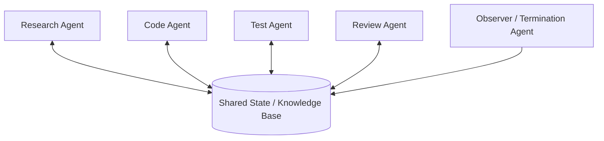
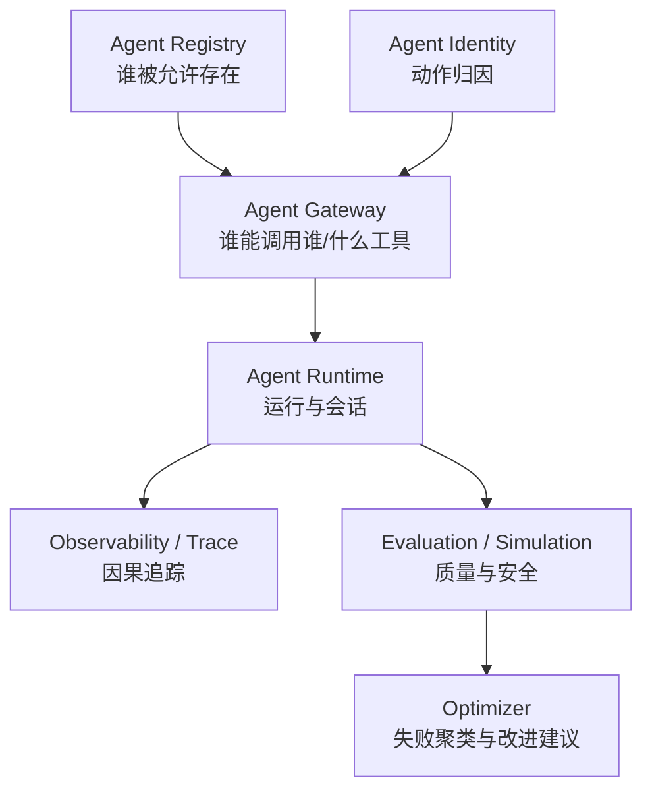

# 多 Agent：职责分化比角色命名更重要

多 Agent 系统不是给几个模型起不同名字，而是把复杂任务拆成不同职责。

Manager 或 Coordinator 负责拆解任务、选择 Worker、分配工作、监控进度、收集结果和汇总输出。HiClaw 的 Manager Agent、OpenHarness 的 Coordinator Mode 都体现了这种职责。

Worker 或 Sub Agent 负责在隔离上下文中完成具体任务，返回压缩结果、证据和产物。Worker 不应擅自扩大任务范围，也不应污染父 Agent 的上下文。

Reviewer 和 Tester 负责独立检查。它们不应只是附和执行 Agent，而要从代码质量、规则遵守、测试结果、回归风险和完成标准角度形成第二反馈回路。

Planner 或 Architect 负责方案设计和风险分析，但不应直接越权实现。Router 或 PM 负责任务流转，但不应替代专业 Agent 做技术判断。

这套分工的价值在于降低单个 Agent 的上下文复杂度，也降低职责混淆。父 Agent 保持全局，子 Agent 处理局部；执行 Agent 做修改，测试 Agent 做验证；协调 Agent 管流程，专业 Agent 管判断。

多 Agent 真正的难点不是“让它们说话”，而是定义输入、输出、权限、上下文、完成标准和冲突处理。

## 架构图：角色职责分化



## Agent 定义示例

```yaml
agents:
  planner:
    model: high-reasoning
    tools: [read_file, grep, web_search]
    can_write: false
    output: plan.md
  executor:
    model: coding
    tools: [read_file, edit_file, bash]
    can_write: true
    blocked_tools: [delegate_task, send_message]
    output: diff + verification
  tester:
    model: fast
    tools: [bash, read_file]
    can_write: false
    output: verification_report.md
```

这个配置体现了多 Agent 的核心：不是角色名不同，而是工具、权限、输出物和职责边界不同。

## 补充：Claude 的五种多 Agent 协调模式

Claude 官方多 Agent 协调文章把常见模式分成五类，这个分类对理解职责分化很有帮助。它的基本建议是：从能工作的最简单模式开始，观察具体瓶颈，再升级协调结构。也就是说，多 Agent 不是从“角色越多越好”开始，而是从信息流、任务边界和失败模式开始。

| 模式 | 适用场景 | 主要风险 |
|---|---|---|
| Generator-Verifier | 输出质量关键，验证标准明确 | verifier 标准不清会橡皮图章化 |
| Orchestrator-Subagent | 任务可清晰拆成有界子任务 | 主 Agent 成为信息瓶颈 |
| Agent Teams | 并行、独立、长期子任务 | 共享资源冲突、完成检测困难 |
| Message Bus | 事件驱动、Agent 生态增长 | 路由错误、追踪困难 |
| Shared State | 协作研究、共享发现 | 重复工作、反应式循环、终止困难 |



### 主从 / Subagent 模式

主从模式最适合清晰任务拆分。主 Agent 保持全局目标，子 Agent 处理独立问题。例如 Claude Code 中，主 Agent 可以继续写代码，同时派子 Agent 去搜索大代码库或调查独立问题。子 Agent 在自己的上下文窗口中工作，只返回压缩发现，避免污染主 Agent 上下文。



### Agent Teams 模式

Agent Teams 和主从模式的区别在于 Worker 持久存在。子 Agent 是一次性调用，Teammate 则会跨多个任务积累领域上下文。大型迁移任务适合这种模式：每个 Worker 负责一个服务，熟悉自己的依赖、测试和部署配置。



### Swarm / 蜂群智能体

蜂群可以理解为 Agent Teams、Message Bus、Shared State 的去中心化组合。多个 Agent 基于局部规则和共享状态工作，不一定有强中心调度。它适合大规模探索和研究，但需要更严格的共享状态协议。

这里要区分两种常被混用的“Swarm”。OpenAI Swarm 是一个实验和教学性质的轻量多 Agent 编排框架，核心原语是 Agent 和 handoff；一个 Agent 可以通过函数返回另一个 Agent，把控制权交过去。它更接近“可控的多 Agent handoff 网络”。而 Claude shared-state 语境下的 swarm 更接近“多个 Agent 围绕共享状态自主协作”。前者重点是路由与交接，后者重点是共享状态、并发冲突和终止条件。



蜂群模式必须有终止条件，例如时间预算、连续 N 轮无新发现、指定 Observer 判断结果充分。否则 Agent 会互相响应、重复探索，持续消耗 token。

## 框架对照：Swarm、Agents SDK、AutoGen

互联网资料中有几个典型框架可以帮助定位多 Agent 的工程演化。

| 框架/资料 | 核心抽象 | 更适合说明什么 |
|---|---|---|
| OpenAI Swarm | Agent、function、handoff、context_variables | 多 Agent 可以用很少原语表达，但仍需要 eval 和外部状态管理 |
| OpenAI Agents SDK | agents、tools、guardrails、handoffs、sessions、tracing、human-in-the-loop、sandbox agents | 从教学式 handoff 走向生产，需要会话、追踪、安全和人工介入 |
| Microsoft AutoGen AgentChat | conversational single / multi-agent applications | 多 Agent 原型与对话协作 |
| Microsoft AutoGen Core | event-driven scalable multi-agent systems | 事件驱动、分布式、多语言、多 Agent 运行时 |

这几个框架的共同趋势是：早期强调“多个 Agent 如何互相转交任务”，生产阶段强调“运行时如何保存状态、追踪因果、限制权限、接入工具、支持人工介入”。因此，多 Agent 章节不能只讲角色，还要讲 Harness 提供的组织制度。

```python
# 伪代码：handoff 网络不是完整 Harness，只是多 Agent 控制流的一部分
class Agent:
    def __init__(self, name, instructions, tools):
        self.name = name
        self.instructions = instructions
        self.tools = tools

def transfer_to_reviewer(context):
    if context["risk"] == "high":
        return reviewer_agent
    return executor_agent

executor_agent = Agent(
    name="executor",
    instructions="Implement scoped changes and return evidence.",
    tools=["read_file", "edit_file", "run_tests", transfer_to_reviewer],
)

reviewer_agent = Agent(
    name="reviewer",
    instructions="Review changes against acceptance criteria.",
    tools=["read_file", "run_tests"],
)
```

这段伪代码只解决“谁接手”。真正落地时，还需要外层 Harness 记录 session、限制工具权限、保留 trace、设置 max_turns、定义完成标准、处理失败回退。

## Google Agent Platform 的企业级多 Agent 视角

Google 的 Gemini Enterprise Agent Platform 把 Agent 平台能力分成 Build、Scale、Govern、Optimize。这个视角说明，多 Agent 不是只在运行时调度，还要有企业级治理：

- Build：ADK、Agent Studio、Agent Garden、sub-agent 网络。
- Scale：Agent Runtime、长时间运行、Memory Bank、Agent Sessions。
- Govern：Agent Identity、Agent Registry、Agent Gateway。
- Optimize：Agent Simulation、Agent Evaluation、Agent Observability、Agent Optimizer。

这和本章的职责分化能对上：Agent 可以协作，但必须有身份、注册表、网关、状态、评测和可观测性。否则多 Agent 的规模化会变成不可审计的自动化混乱。


