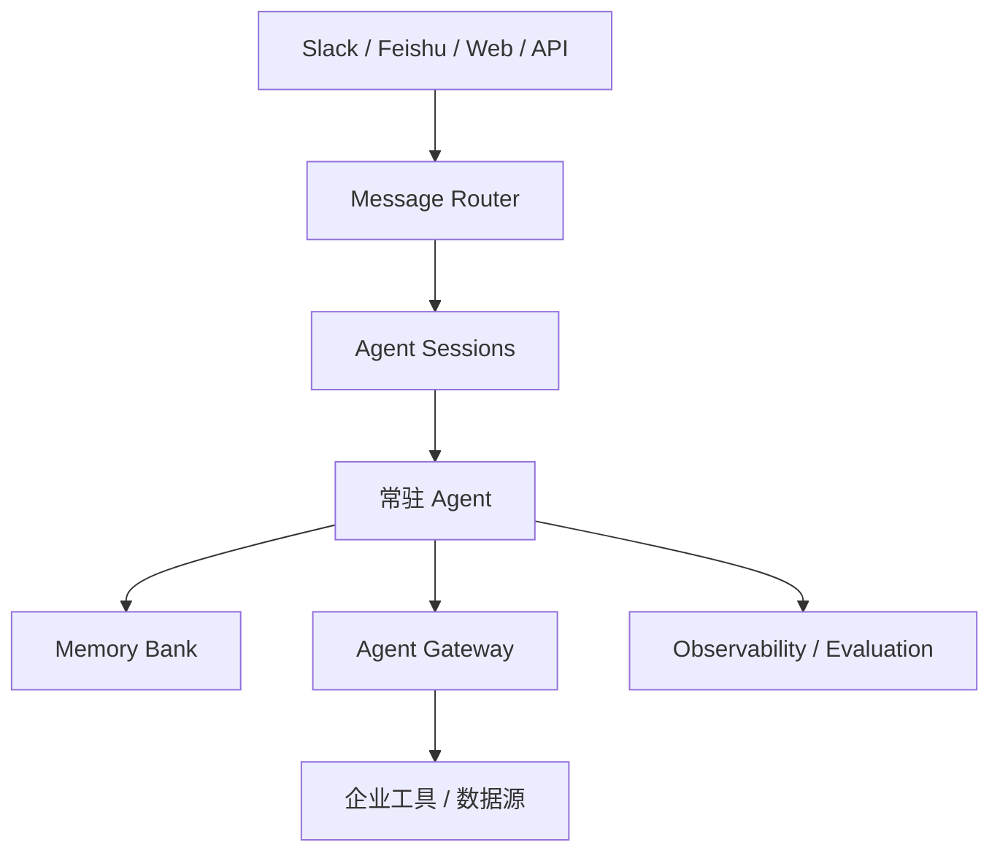

# 跨平台常驻 Agent：身份、会话和后台任务

跨平台常驻 Agent 不再只面对一个终端窗口。它可能同时连接 Telegram、Slack、Discord、飞书、微信、Web UI 和后台调度器。

这类 Agent 的职责更复杂。它要维护会话身份，区分不同用户和渠道，把消息映射到正确 thread 或 session，支持主动通知，处理后台任务，维护长期记忆，同时遵守平台权限和隐私边界。

Hermes 的 ACP Adapter 把不同消息平台转换为统一协议，让 Agent 核心不关心平台差异。OpenHarness 的 ohmo Gateway 把外部消息、会话 runtime 和 Agent 运行池解耦。DeerFlow 的 MessageBus 和 ChannelManager 把飞书、Slack、Discord、Telegram、微信等平台消息统一路由到 Agent 线程。HiClaw 则用 Matrix 房间承载所有人机和 Agent 间通信。

这些设计共同说明：跨平台 Agent 的核心不是“多接几个入口”，而是身份和会话治理。

风险也来自这里。身份串线会把一个用户的信息泄露给另一个用户；权限混淆会让低权限渠道触发高权限动作；后台任务黑箱会让用户不知道 Agent 正在做什么。

因此，Agent 可以负责处理消息和任务，但 Harness 必须管理路由、会话、权限、审计和停止机制。

## Google Agent Platform 对常驻 Agent 的启发

Google 在 Gemini Enterprise Agent Platform 中强调长时间运行、状态、身份、注册表、网关、记忆和可观测性。这些能力正好对应跨平台常驻 Agent 的核心难点。

常驻 Agent 和普通聊天 Agent 最大区别是：它不是一次性回复，而是可能持续数天、跨多个系统、面向多个用户和业务对象运行。Google 提到的 Agent Runtime、Memory Bank、Agent Sessions、Agent Identity、Agent Gateway、Agent Observability，本质上是在回答这些问题：

- Agent 如何跨天保持状态？
- 用户或业务系统如何追踪某次会话？
- 每个 Agent 的身份和权限如何审计？
- Agent 调用工具和系统时如何统一网关控制？
- 线上行为如何持续评测和观察？

这说明跨平台常驻 Agent 的职责不能只写成“回复消息”。它还要承担会话连续性、长期上下文、后台任务和多系统连接。但这些职责必须被 Harness 支撑，否则 Agent 很容易丢状态、串身份或越权。

