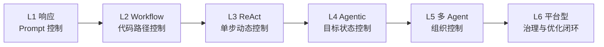

# Agent 职责成熟度模型

Agent 职责可以分成五个成熟度层级。

L1 是响应型 Agent。它主要根据 prompt 回答问题，没有真实工具、状态和验证。它适合问答、写作和轻量分析，不适合生产任务。

L2 是工具型 Agent。它可以调用搜索、读写文件、运行命令等工具。但如果缺少权限、状态和验证，它只是“会动手的模型”，风险仍然高。

L3 是任务型 Agent。它具备目标理解、计划、工具调用、验证和状态记录，能够完成有限工程任务。多数代码 Agent 至少要达到这一层，才算具备基本生产能力。

L4 是协作型 Agent。它能在多 Agent 系统中担任 Manager、Worker、Reviewer、Tester 等角色，遵守通信协议、上下文隔离和权限边界。HiClaw、OpenHarness Coordinator、Claude Code 子 Agent 都属于这一方向。

L5 是自进化 Agent。它能在受控范围内沉淀记忆、生成 Skill、分析历史失败并改进 Harness。但 L5 的关键不是完全自治，而是在审计和回滚机制下持续改进。

这个模型说明，Agent 能力提升不只是模型增强，也包括职责清晰、边界可靠、反馈完整和状态可恢复。

## 从成熟度到平台能力

如果把 Google Agent Platform 的 Build、Scale、Govern、Optimize 映射到这个成熟度模型，可以得到一个更工程化的判断：

| 成熟度 | Agent 表现 | 平台能力需求 |
|---|---|---|
| L1 响应型 | 回答问题 | Prompt 与基本上下文 |
| L2 工具型 | 调用工具 | Tool Registry、Schema、权限 |
| L3 任务型 | 完成闭环任务 | Runtime、状态、验证、观测 |
| L4 协作型 | 多 Agent 协同 | Agent Identity、Registry、Gateway、Sessions |
| L5 自进化型 | 基于历史改进 | Simulation、Evaluation、Observability、Optimizer |

这个表说明，Agent 的进化不是靠“更大胆授权”实现的，而是靠平台能力托底。没有身份、注册表和网关，多 Agent 不适合规模化；没有评测和可观测性，自进化也只是自我修改。

## 增补层级：Agentic Agent

可以在 L3 和 L4 之间补一个关键阶段：Agentic Agent。它已经不是简单工具调用者，而是可以围绕业务 outcome 主动推进任务。它可能仍是单 Agent，也可能开始调用子 Agent。

Agentic Agent 的标志是：

- 能维护多步目标。
- 能跨工具和系统行动。
- 能保留任务状态。
- 能在失败后重规划。
- 能提交验证证据。

但它还不一定具备复杂多 Agent 组织能力。很多企业场景应先把单个 Agentic Agent 做稳，再考虑 Agent Teams 或 Swarm。

## 互联网资料校准后的成熟度解释

结合 ReAct、Plan-and-Execute、Anthropic workflow/agent 区分、Google Agent Platform、OpenAI Agents SDK 和 AutoGen，可以把成熟度模型进一步校准为“控制权逐步转移”的模型。

| 阶段 | 控制权主要在哪里 | 典型外部模式 | 需要补齐的 Harness |
|---|---|---|---|
| L1 响应型 | Prompt 与用户 | 单次 LLM 调用 | 提示模板、上下文选择 |
| L2 Workflow 型 | 代码路径 | Prompt chaining、routing、parallelization | 节点 schema、gate、错误分支 |
| L3 ReAct / 工具型 | 单步 Agent loop | ReAct、Action Agent | 工具文档、权限、max_turns、观察摘要 |
| L4 计划型 / Agentic | 目标级任务状态 | Plan-and-Execute、autonomous agent | 计划状态、会话、记忆、验证、重规划 |
| L5 协作型 | 多 Agent 组织 | Orchestrator-subagent、Agent Teams、handoffs | 身份、注册表、消息协议、上下文隔离 |
| L6 平台型 / 自进化 | 平台治理闭环 | Agent Platform、Agents SDK、AutoGen Core | 仿真、评测、观测、优化器、审计回滚 |

这个版本比“五级模型”更细，是因为外部资料把两个容易混淆的阶段拆开了：workflow 不等于 Agent，Agentic 单 Agent 也不等于多 Agent。很多系统在 L2 到 L4 之间已经能创造业务价值，不必直接跳到 L5 或 L6。

成熟度提升的判断标准不是“有没有更多 Agent”，而是系统是否把新增控制权变成了可观察、可验证、可回滚的工程能力。否则升级只会扩大失败半径。
