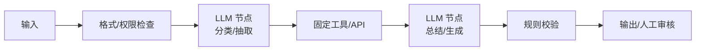

# Workflow 型 Agent：确定流程中的局部智能

Workflow 型 Agent 严格说并不是完全自治 Agent，而是把 LLM 放进预定义流程中的某些节点。Anthropic 把这类系统称为 workflow：LLM 和工具沿固定代码路径被编排，模型不负责决定整体流程，只负责局部判断、生成或转换。

它适合流程稳定、边界明确、风险较高的场景。例如客服分流、合同条款抽取、评测报告生成、审批材料预处理、日志分类、知识库问答补全。这类任务的共同点是：流程可提前设计，异常分支可枚举，完成标准可以写清楚。



## 职责边界

Workflow 型 Agent 的 Agent 职责很窄：理解当前节点输入，按 schema 输出结果，解释失败原因。它不应该自己改变流程，不应该临时新增工具，不应该绕过 gate，也不应该把局部判断升级为全局决策。

Harness 职责更重：定义流程图、节点输入输出、错误分支、权限、验证规则、人工审核点和日志。换句话说，智能在节点里，控制在 Harness 里。

## 工程配置示例

```yaml
workflow_agent:
  mode: predefined_path
  nodes:
    - id: classify_ticket
      llm_task: classify
      output_schema: ticket_type.schema.json
      allowed_labels: [billing, technical, refund, general]
    - id: retrieve_policy
      tool: knowledge_base.search
      input_from: classify_ticket
    - id: draft_response
      llm_task: generate_response
      requires_evidence: true
  gates:
    - after: classify_ticket
      check: label_confidence >= 0.75
    - after: draft_response
      check: no_policy_contradiction
```

## 适用判断

当任务能拆成固定节点时，优先使用 Workflow 型 Agent。它的优势不是“聪明”，而是稳定、便宜、可审计。很多企业生产系统应该从这里开始，而不是从自治 Agent 开始。

升级条件很明确：如果流程分支越来越多，节点之间强依赖实时发现，或者任务路径无法提前枚举，才考虑 ReAct 或 Plan-and-Execute。

