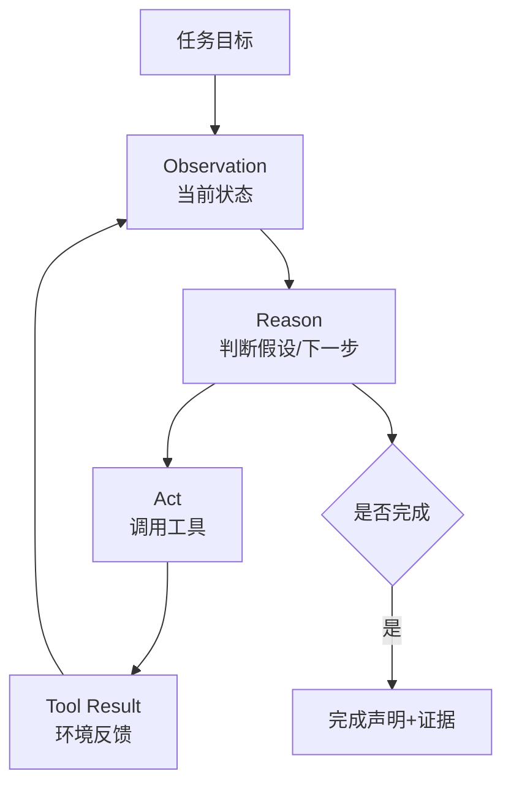

# ReAct 单 Agent：观察、推理、行动的微循环

ReAct 单 Agent 是从固定 workflow 走向动态 Agent 的关键一步。ReAct 原论文提出的核心不是让模型“多想”，而是让模型把推理和行动交错起来：推理用于维护假设、跟踪计划、处理异常；行动用于调用外部工具、知识库或环境获取新证据。



## 典型 Agent 形态

ReAct 型 Agent 适合路径不确定的任务：排查 bug、搜索代码、网页操作、故障诊断、研究资料补全、命令行探索。它不需要一开始写出完整计划，而是从当前观察出发，做一步、看一步、修正一步。

在代码 Agent 中，ReAct 往往表现为：读错误、搜索文件、打开代码、运行测试、根据错误再定位。它的优势是灵活，能够快速吸收环境反馈。

## Harness 要求

ReAct 的风险是局部循环。Agent 可能围绕同一个错误反复尝试，或者被工具返回的局部信息牵着走。因此 Harness 至少需要：

- 最大迭代次数。
- 工具调用日志。
- 失败模式检测。
- 重复行动检测。
- 关键观察摘要。
- 完成前验证要求。

## 伪代码

```python
for turn in range(max_turns):
    observation = harness.observe(state)
    action = agent.decide(goal, observation, history)
    if action.type == "finish":
        return harness.verify(action.evidence)
    result = harness.run_tool(action.tool, action.args)
    state = harness.update_state(state, action, result)
    if harness.detect_loop(state):
        state = harness.force_reframe(state)
```

ReAct 是 Agent 的基础循环，但不是完整项目管理。任务一旦变长，就需要显式计划、状态压缩和阶段验证。

