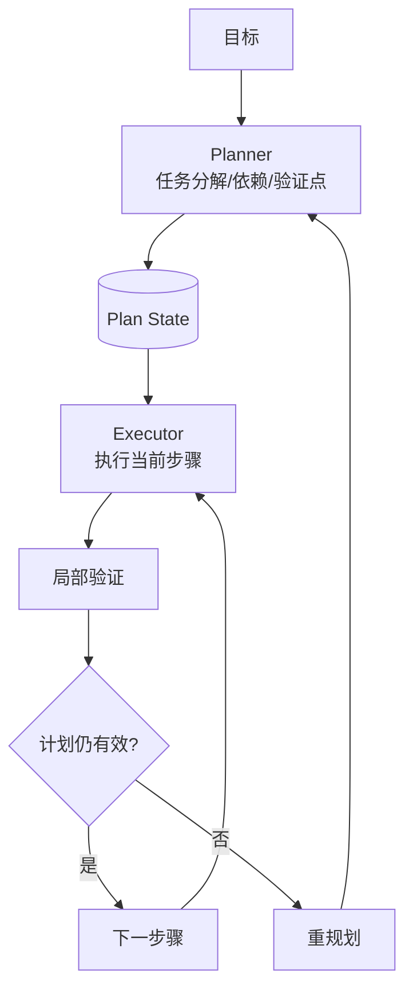

# Plan-and-Execute 型 Agent：把规划和执行分开

Plan-and-Execute 型 Agent 解决的是 ReAct 在长任务中的短视问题。LangChain 对这一模式的解释很清楚：先由 planner 规划步骤，再由 executor 针对每一步选择工具或行动。Planner 负责全局结构，executor 负责局部执行。



## 典型 Agent 形态

Plan-and-Execute 适合跨文件修改、系统迁移、长链路研究、多阶段交付。它不适合所有任务，因为计划本身也有成本。短任务如果强行计划，会增加延迟和形式感。

成熟工程 Agent 往往采用混合模式：先 ReAct 式调查，拿到事实后形成轻量计划；执行每一步时继续读取反馈；计划失效时重规划。

## 职责边界

Planner 不应直接修改世界，它负责拆解、排序、标注风险和定义验证点。Executor 不应擅自扩大任务，它负责完成当前步骤并返回证据。Harness 负责保存计划状态、约束并发步骤、记录验证结果。

```json
{
  "plan_id": "migrate-auth-service",
  "steps": [
    {"id": "s1", "goal": "identify auth entrypoints", "status": "done", "evidence": ["routes/auth.ts"]},
    {"id": "s2", "goal": "patch token refresh flow", "status": "in_progress", "risk": "medium"},
    {"id": "s3", "goal": "run auth integration tests", "status": "pending", "must_pass": true}
  ],
  "replan_when": ["test_failure_unknown_root_cause", "dependency_not_found", "scope_change"]
}
```

## 常见失败

计划幻觉是最大风险。计划写得完整，不代表它基于真实代码和环境。解决方式不是取消计划，而是要求计划带证据：哪些事实已确认，哪些是假设，哪些步骤需要先验证。

