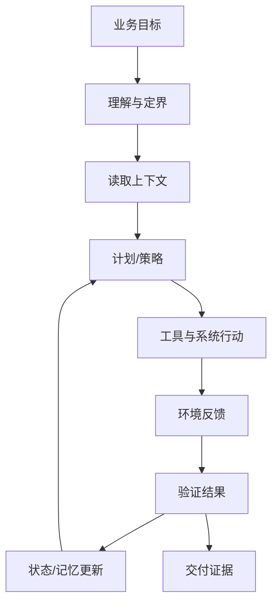

# Agentic Agent：面向结果的行动主体

Agentic Agent 不是“能调工具的聊天模型”，而是能围绕目标持续推进任务的行动主体。它会理解目标、读取上下文、选择工具、维护状态、解释反馈、触发验证，并在失败后调整策略。

Anthropic 对 agents 的描述强调动态控制流程和工具使用；Google Gemini Enterprise Agent Platform 则把企业 Agent 的目标从管理单个 AI 任务，提升到委派业务结果。两者合起来看，Agentic Agent 的核心是 outcome-oriented。

## 能力构成

Agentic Agent 至少要具备六项能力：

- 多步目标维护。
- 跨工具行动。
- 任务状态保存。
- 失败后重规划。
- 完成证据提交。
- 必要时请求人类判断。

它可以是单 Agent，也可以调子 Agent，但重点不是数量，而是它是否能稳定推进一个 outcome。

## Harness 要求

Agentic Agent 必须依赖更厚的 Harness。Google 的 Build / Scale / Govern / Optimize 可以直接映射为工程要求：

| 平台能力 | 对 Agentic Agent 的意义 |
|---|---|
| Build | 有清晰构建方式、工具定义、子 Agent 组合方式 |
| Scale | 能长时间运行，保持 session、state 和 memory |
| Govern | 有身份、权限、注册表、网关和安全策略 |
| Optimize | 有仿真、评测、观测和失败聚类优化 |

没有这些能力，Agentic Agent 很容易变成“看似自主、不可审计”的自动化脚本。

