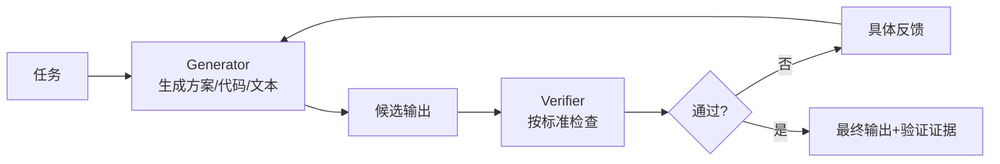

# Generator-Verifier 型 Agent：用第二反馈回路保证质量

Generator-Verifier 是最简单也最常用的多 Agent 模式。一个 Agent 负责生成，另一个 Agent 负责验证。验证不通过时，反馈回到生成 Agent，进入下一轮修正。



## 适用场景

它适合质量标准明确的任务：代码生成后跑测试、事实回答后查证、合规文本检查、评分 rubric 评估、客服回复核对知识库。关键前提是 verifier 有明确标准，而不是一句“看看好不好”。

## 职责边界

Generator 负责产出候选结果，不负责降低验收标准。Verifier 负责依据标准检查，不负责为了通过而修改标准。Harness 负责提供 rubric、测试、知识库、最大迭代次数和人工兜底。

```yaml
generator_verifier:
  generator:
    tools: [read_context, draft_output]
  verifier:
    tools: [run_tests, check_policy, compare_with_sources]
    must_return:
      - pass: boolean
      - failed_criteria: list
      - actionable_feedback: string
  loop:
    max_iterations: 3
    fallback: human_review
```

## 常见失败

最危险的是“橡皮图章 verifier”。如果验证标准不清，verifier 会倾向于认可 generator 的输出。第二个风险是振荡：generator 无法修复 verifier 提出的问题，系统在同一问题上循环。因此必须有迭代上限和失败升级路径。

