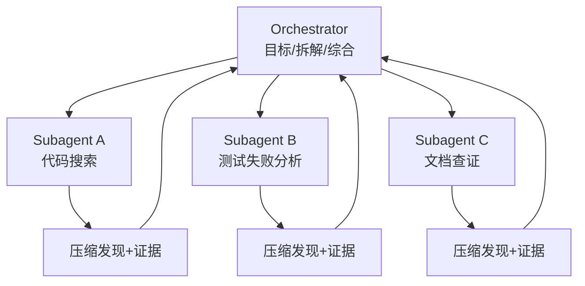

# Orchestrator-Subagent 型 Agent：主 Agent 保持全局，子 Agent 处理局部

Orchestrator-Subagent 是主从式多 Agent。主 Agent 负责理解目标、拆分任务、分派子任务、汇总结果；Subagent 在独立上下文中处理有界问题，并返回压缩发现、证据和产物。



## 适用场景

这个模式适合任务可以拆成相对独立子问题，但仍需要一个中心保持全局判断的情况。例如代码审查时分别检查安全、测试、架构；工程任务中主 Agent 写代码，子 Agent 搜索大代码库或调查独立错误。

## 职责边界

Orchestrator 不应该把模糊任务直接甩给子 Agent。它需要定义子任务边界、输入材料、禁止事项、预期输出和完成标准。Subagent 不应擅自扩大范围，也不应把未经验证的猜测当结论返回。

```yaml
subtask_contract:
  id: inspect-auth-timeout
  objective: find why auth timeout test fails
  allowed_files: ["src/auth/**", "tests/auth/**"]
  can_write: false
  output:
    - summary
    - evidence_paths
    - confidence
    - open_questions
```

## 主要风险

主 Agent 会成为信息瓶颈。子 Agent 之间如果有依赖，信息必须经主 Agent 转发，摘要过程中容易丢细节。因此这个模式适合“子任务相对独立”的问题，不适合强耦合协作。

