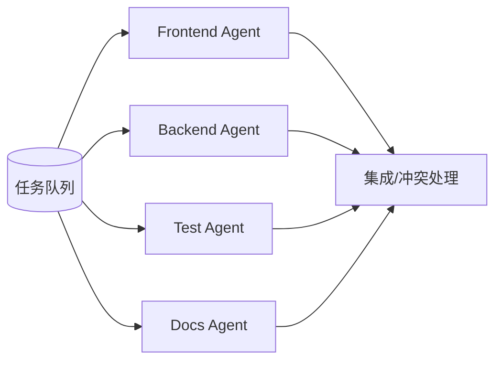

# Agent Teams 型 Agent：长期并行的职责团队

Agent Teams 与 Orchestrator-Subagent 的区别在于 Worker 是否长期存在。Subagent 通常完成一个有界子任务后结束；Team Agent 会跨多个任务持续工作，积累领域上下文和局部状态。



## 适用场景

Agent Teams 适合大型迁移、批量重构、多服务改造、长期研究项目。每个 Agent 负责一个领域或服务，持续处理相关任务，逐步熟悉局部依赖、测试入口和风格。

## Harness 要求

Team Agent 的难点不是启动多个 Agent，而是任务分区和冲突处理：

- 任务队列要清楚。
- 每个 Agent 的写入范围要隔离。
- 共享文件要加锁或人工合并。
- 完成状态要可追踪。
- 集成测试要统一收口。

```yaml
agent_team:
  coordinator:
    owns: task_queue
  members:
    - name: frontend_agent
      write_scope: ["apps/web/**"]
    - name: backend_agent
      write_scope: ["services/api/**"]
    - name: test_agent
      write_scope: ["tests/**"]
  integration:
    conflict_policy: coordinator_review
    required_checks: [unit_tests, integration_tests]
```

## 主要风险

Agent Teams 要求子任务独立。如果多个 Agent 同时修改同一抽象、同一数据库 schema 或同一公共模块，冲突会迅速放大。它不是“并行越多越快”，而是“分区越清楚越有效”。

