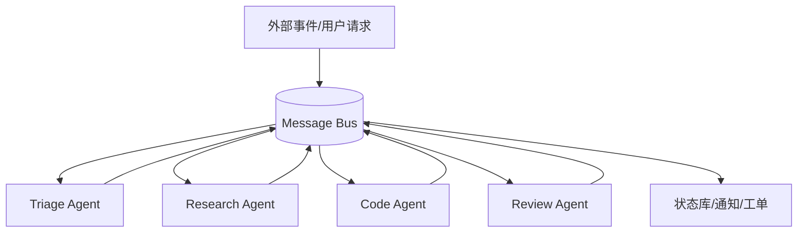

# Message Bus 型 Agent：事件驱动的多 Agent 管线

Message Bus 型 Agent 通过发布/订阅事件协作。Agent 不直接互相调用，而是向消息总线发布事件，由路由器把事件投递给订阅者。Claude 将它列为多 Agent 协调模式之一，AutoGen Core 也强调事件驱动的可扩展多 Agent 系统。



## 适用场景

Message Bus 适合事件流驱动的系统：安全告警分析、客服工单处理、数据管道、监控自动化、跨团队 Agent 生态。它的优势是扩展性，新 Agent 可以订阅新事件，不必改动所有已有连接。

## 职责边界

每个 Agent 只处理自己订阅的事件类型，输出结构化事件。Router 或 Bus 不应把语义模糊的消息随意广播。Harness 要负责事件 schema、correlation id、重试、死信队列、追踪和权限。

```json
{
  "event_id": "evt_123",
  "correlation_id": "incident_456",
  "type": "security.alert.triaged",
  "severity": "high",
  "payload": {
    "asset": "auth-gateway",
    "suspected_issue": "credential stuffing"
  },
  "produced_by": "triage_agent"
}
```

## 主要风险

Message Bus 的灵活性会增加追踪难度。一次请求可能触发多个 Agent，形成级联事件。如果没有 correlation id 和 trace，系统出错时很难回答“到底哪个 Agent 做了什么”。路由错误也可能静默失败：事件没有被正确处理，但系统没有明显崩溃。

