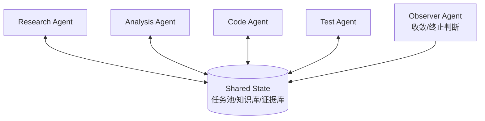

# Shared State 与 Swarm 型 Agent：通过共享环境协作

Shared State 型 Agent 不依赖中心 orchestrator 或 message router，而是多个 Agent 直接读写共享状态。这个共享状态可以是数据库、文档、任务池、知识库、代码仓库或画板。Swarm / 蜂群式协作通常建立在这种共享状态之上。



## 两种 Swarm

工程语境里要区分两种 Swarm。

第一种是 OpenAI Swarm 这类 handoff 网络。它用 Agent 和 handoff 表达轻量多 Agent 编排，重点是控制权从一个 Agent 转交给另一个 Agent。

第二种是 shared-state swarm。多个 Agent 不一定有强中心调度，而是通过共享状态互相影响，适合大规模探索和研究。

## Harness 要求

Shared State / Swarm 的 Harness 要求最高：

- 写入必须有版本。
- 重要结论必须带来源。
- 并发修改要有锁或冲突合并。
- Agent 行动要可归因。
- 必须有终止条件。
- 必须有 Observer 或人工复核。

```yaml
shared_state_rules:
  write_mode: append_only
  required_fields: [claim, evidence, confidence, author_agent, timestamp]
  conflict_resolution:
    same_claim_different_answer: reviewer_agent
  termination:
    max_rounds: 8
    no_new_evidence_rounds: 2
    final_decider: observer_agent
```

## 主要风险

Swarm 很容易出现重复探索、互相响应、结论污染和无法终止。它适合高并行探索，不适合强一致写入任务。没有共享状态协议的 swarm，本质上是多个 Agent 同时制造噪声。

