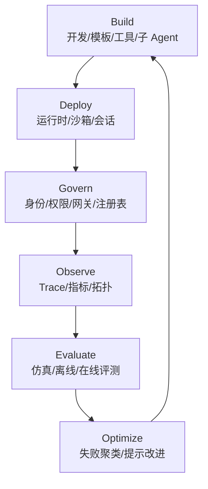

# 企业平台型 Agent：从单体能力到可治理资产

企业平台型 Agent 的核心不是某个 Agent 更强，而是 Agent 被纳入平台生命周期：构建、部署、运行、治理、观测、评测、优化。Google Gemini Enterprise Agent Platform 的 Build / Scale / Govern / Optimize 提供了一个清晰框架；OpenAI Agents SDK 和 AutoGen 也体现了类似趋势。



## 平台型 Agent 的组成

平台型 Agent 至少需要这些能力：

| 层 | 能力 |
|---|---|
| 构建层 | ADK、低代码 Studio、模板、工具注册、子 Agent 组合 |
| 运行层 | Runtime、Sandbox、Sessions、Memory、长任务支持 |
| 治理层 | Agent Identity、Registry、Gateway、IAM、策略 |
| 观测层 | Trace、拓扑、日志、成本、延迟、失败归因 |
| 评测层 | Simulation、offline eval、online eval、rubric |
| 优化层 | 失败聚类、prompt 优化、回归测试、版本管理 |

## 与普通 Agent 的区别

普通 Agent 关注“能不能完成这次任务”。企业平台型 Agent 关注“能不能长期、批量、可审计地完成一类任务”。这要求 Agent 从 prompt 资产升级为软件资产。

```yaml
enterprise_agent_asset:
  identity: agent://finance/expense-controller
  owner: finance-platform-team
  runtime: managed_sandbox
  tools:
    - expense_api.submit
    - policy_db.search
  guardrails:
    input: [pii_filter, prompt_injection_check]
    output: [policy_compliance_check]
  evaluation:
    offline_suite: expense_cases_v3
    online_monitoring: true
  observability:
    trace: required
    cost_budget_per_run: 1.50
```

## 主要风险

平台型 Agent 最大风险是“规模化错误”。单个 Agent 偶发错误还能人工修正；平台化后，错误可能通过模板、注册表、共享工具和自动优化扩散。因此企业平台必须有版本、灰度、回滚、审计、权限和人类接管机制。

