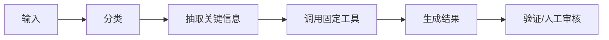
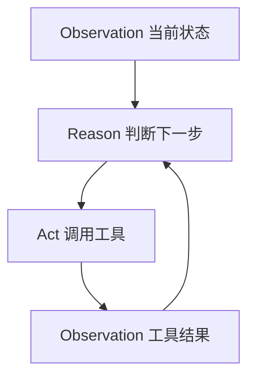
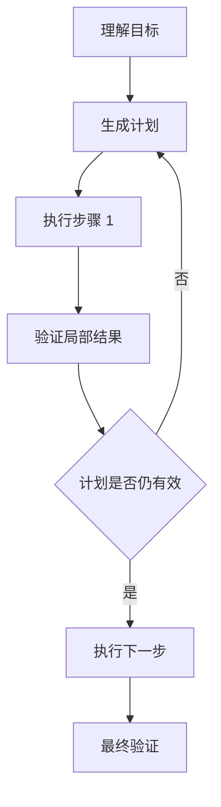
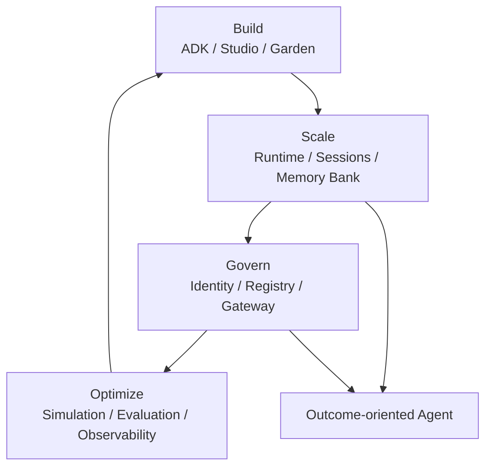
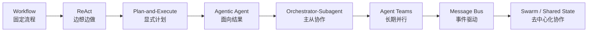

# Agent 演化发展：从工作流到 Agentic Agent，再到多 Agent 组织

Agent 的发展不是一条“越来越自主”的直线，而是一条职责逐步外扩、风险逐步上升、Harness 逐步变厚的演化路径。理解这条路径，有助于判断什么时候该用简单 workflow，什么时候用单 Agent，什么时候引入 ReAct、Plan-and-Execute，什么时候走向多 Agent，什么时候才需要 swarm / 蜂群式协作。

这一章结合了几类外部资料：ReAct 原论文、LangChain 对 Plan-and-Execute 的工程化说明、Anthropic 对 workflow / agent 的区分、Claude 多 Agent 协调模式、Google Gemini Enterprise Agent Platform，以及 OpenAI Swarm / Agents SDK、Microsoft AutoGen 这类多 Agent 框架。它们的共同结论很接近：Agent 能力的演化不是把模型权限放大，而是把目标、工具、状态、身份、评测和协作协议逐步工程化。

## 细分阅读目录

本章已继续拆成 10 篇细分稿，每篇聚焦一种 Agent 或协作形态：

| 阶段 | 细分稿 | 重点问题 |
|---|---|---|
| Workflow | `19-Agent演化发展-拆分/01-Workflow型Agent.md` | 什么时候不该上自治 Agent |
| ReAct | `19-Agent演化发展-拆分/02-ReAct单Agent.md` | 单 Agent 如何通过观察-推理-行动循环探索 |
| Plan-and-Execute | `19-Agent演化发展-拆分/03-Plan-and-Execute型Agent.md` | 长任务中如何拆开规划和执行 |
| Agentic Agent | `19-Agent演化发展-拆分/04-AgenticAgent.md` | 如何从工具调用者变成面向 outcome 的行动主体 |
| Generator-Verifier | `19-Agent演化发展-拆分/05-Generator-Verifier型Agent.md` | 如何用第二反馈回路保证质量 |
| Orchestrator-Subagent | `19-Agent演化发展-拆分/06-Orchestrator-Subagent型Agent.md` | 主 Agent 和子 Agent 如何分工 |
| Agent Teams | `19-Agent演化发展-拆分/07-AgentTeams型Agent.md` | 长期并行团队如何组织 |
| Message Bus | `19-Agent演化发展-拆分/08-MessageBus型Agent.md` | 事件驱动多 Agent 如何扩展 |
| Shared State / Swarm | `19-Agent演化发展-拆分/09-SharedState与Swarm型Agent.md` | 蜂群协作如何共享状态与终止 |
| 企业平台型 Agent | `19-Agent演化发展-拆分/10-企业平台型Agent.md` | Agent 如何成为可治理的软件资产 |

## 一、Workflow：确定流程优先于智能决策

最早、也最稳的形态是 Workflow。Workflow 的核心是：流程由人或系统预先定义，模型只在局部节点中完成分类、抽取、总结、生成等任务。

Anthropic 在 “Building Effective AI Agents” 中把 workflow 和 agent 明确区分开：workflow 是 LLM 和工具沿预定义代码路径被编排；agent 则由 LLM 动态决定流程和工具使用。这个区分对 Harness 很关键，因为很多系统其实只是“LLM workflow”，却被包装成 Agent。判断标准不是有没有模型，而是模型是否负责过程控制。

典型例子是用户反馈处理：收集反馈，分类，聚类，查日志，生成修复建议，创建工单。每一步的输入输出都相对确定。Agent 的“自主性”很低，但系统可靠性高。

Workflow 适合：

- 流程稳定。
- 分支有限。
- 验收标准明确。
- 风险较高，不希望模型自由探索。

它的问题是弹性不足。一旦任务路径高度依赖中间发现，预设流程会越来越复杂，最后变成大量 if/else 和补丁式规则。

Anthropic 总结的常见 workflow 形态包括 prompt chaining、routing、parallelization、orchestrator-workers、evaluator-optimizer。它们不是落后的形态，而是更可控的形态。能用 workflow 稳定解决的问题，不应该为了“智能体感”强行升级为自治 Agent。



## 二、单 Agent：从固定流程转向动态决策

单 Agent 的出现，是因为很多任务无法提前写死流程。代码修复、复杂调研、日志诊断、网页操作，都需要根据中间结果动态决定下一步。

单 Agent 通常具备：

- 任务目标。
- 上下文读取能力。
- 工具调用能力。
- 多轮循环。
- 反馈解释能力。
- 完成声明与验证。

这时 Agent 的职责从“执行固定步骤”变成“决定下一步”。但这也意味着 Harness 要提供更强边界：工具 schema、权限、状态、验证、上下文压缩。

## 三、ReAct：边想边做的单 Agent 模式

ReAct 可以理解为单 Agent 的基础行动模式：Reason + Act。Agent 在每一轮先根据当前观察推理，再调用工具行动，再根据工具返回继续推理。

ReAct 原论文的核心贡献，是把推理轨迹和任务动作交错生成。推理让 Agent 跟踪计划、更新假设、处理异常；行动让 Agent 接触知识库、环境或工具来获得新信息。与单纯 chain-of-thought 相比，ReAct 的关键不是“想得更长”，而是“想和做互相校正”。

它适合探索性任务，因为不需要一开始制定完整计划。比如查一个 bug：先读错误，搜索代码，打开相关文件，运行测试，再决定下一步。



ReAct 的风险是局部最优。Agent 容易在短反馈里绕圈，尤其当工具结果复杂、目标不清或验证信号弱时。Loop Detection、最大迭代次数、任务状态记录和“换思路”反馈，是 ReAct 模式下常见的 Harness 补强。

所以 ReAct 更像 Agent 的微循环，而不是完整项目管理方法。它适合“下一步取决于刚刚观察到什么”的任务，例如代码定位、网页操作、故障诊断、资料检索；但当任务跨度变长，单靠 ReAct 容易让上下文被历史步骤淹没。

## 四、Plan-and-Execute：先规划，再执行，再修正

Plan-and-Execute 把“计划”和“执行”显式拆开。Agent 先建立任务分解和验证点，再逐步执行。它比 ReAct 更适合长任务，因为计划能提供全局结构。

LangChain 早期把 Plan-and-Execute 与 ReAct 风格的 Action Agent 做了对比：Action Agent 每轮选择工具并观察结果；Plan-and-Execute 先由 planner 规划步骤，再由 executor 针对每个步骤选择工具或行动。它的优势是分离关注点，planner 专注全局分解，executor 专注局部执行。代价是模型调用更多，也更依赖计划质量。



Plan-and-Execute 的风险是计划幻觉。计划写得很完整，不代表它基于真实代码和环境。因此，成熟系统往往要求“调查后计划”，或者在计划中明确哪些步骤是待验证假设。

Plan-and-Execute 还需要“可重规划”能力。LangChain 当时也指出，初始版本只在开头规划，后续不复盘计划，这会限制长任务表现。放到 Harness 中，计划应该是状态对象，而不是一次性文本：每个步骤有证据、状态、验证点和失效条件。

Claude Code、OpenHarness、DeerFlow 这类工程 Agent 都不是纯 ReAct 或纯 Plan-and-Execute，而是混合模式：先做足够调查，形成轻量计划，再在执行中用 ReAct 式反馈修正。

## 五、Agentic Agent：从任务执行者到 outcome-oriented agent

Agentic Agent 指的不只是“能调用工具”，而是能围绕业务结果自主推进。Google 在 Gemini Enterprise Agent Platform 中把企业 Agent 的方向描述为从管理单个 AI 任务，走向更有信心地委派业务结果；其平台能力也按 Build、Scale、Govern、Optimize 展开。

这说明 Agentic Agent 至少需要四类能力：

1. **Build**：能被低代码或代码优先方式构建，能组织 sub-agents 和工具。
2. **Scale**：能长时间运行、保持状态、使用长期记忆。
3. **Govern**：有身份、注册表、网关、权限和安全策略。
4. **Optimize**：有仿真、评测、可观测性和失败聚类优化。

Agentic Agent 的重点不是“更像人”，而是“能承担结果责任”。但结果责任不能只由模型承担，必须由 Harness 提供身份、状态、权限、评测和审计。

从 Google 的企业平台设计看，Agentic Agent 的工程形态至少包括：开发层的 ADK / Agent Studio / Agent Garden，运行层的 Agent Runtime / Sessions / Memory Bank，治理层的 Agent Identity / Registry / Gateway，优化层的 Simulation / Evaluation / Observability / Optimizer。也就是说，企业级 Agent 不是一个 prompt，而是一套可构建、可部署、可追踪、可治理、可优化的软件资产。



## 六、多 Agent：当单 Agent 上下文和职责承载不住

多 Agent 不是单 Agent 的自然升级，而是当任务具备明确结构时才值得引入。Claude 官方的 coordination patterns 给出了一条很清晰的判断路径：从最简单能工作的模式开始，观察瓶颈，再演化到更复杂模式。

常见模式包括：

- Generator-Verifier：一个生成，一个验证。
- Orchestrator-Subagent：主 Agent 拆任务，子 Agent 做有边界的子任务。
- Agent Teams：多个长期 Worker 并行处理独立任务。
- Message Bus：事件驱动的 Agent 管线。
- Shared State：多个 Agent 通过共享状态协作。

这些模式不是“越后越高级”，而是适配不同结构。多 Agent 的核心问题是上下文边界和信息流，而不是角色名。

OpenAI Swarm 的 README 也能印证这一点。Swarm 把 Agent 和 handoff 作为两个轻量原语：Agent 封装 instructions 和 tools，handoff 让一个 Agent 把对话转交给另一个 Agent。它强调可控、轻量和易测试，同时也明确 Swarm 是实验和教学性质，生产场景应迁移到 OpenAI Agents SDK。这个变化本身说明，多 Agent 从“演示性编排”走向生产后，必须补上 guardrails、sessions、tracing、human-in-the-loop、sandbox agent 等 Harness 能力。

Microsoft AutoGen 的定位也类似：AgentChat 适合构建单 Agent 和多 Agent 对话应用，Core 则是事件驱动的可扩展多 Agent 框架，面向业务流程、协作研究和分布式 Agent。这类框架的共同方向，是把“Agent 之间互相聊天”升级成“有运行时、有事件、有协议、有外部工具扩展”的工程系统。

## 七、Swarm / 蜂群智能体：去中心化协作的高风险形态

Swarm 智能体通常指没有强中心调度、多个 Agent 基于共享环境、消息、局部规则或共享状态自主协作的形态。它接近 Claude patterns 中的 shared-state，也可能结合 message bus 和 agent teams。

蜂群模式的优点是弹性强、单点故障少、适合大规模探索。例如多个研究 Agent 同时调查不同来源，把发现写入共享知识库，其他 Agent 看到后继续扩展。

但它的风险也最大：

- 重复工作。
- 并发写冲突。
- 反应式循环。
- 目标漂移。
- 终止条件不清。
- 归因困难。

因此，swarm 不应作为起点。只有当任务确实需要大量并行探索、共享发现和去中心化容错时，才值得使用。即使使用，也必须有共享状态协议、锁、版本、终止条件、观察者 Agent 和人工兜底。

工程上可以把 Swarm 分成两种：一种是 OpenAI Swarm 这类“handoff 网络”，本质是轻量多 Agent 编排；另一种是更接近蜂群协作的 shared-state 模式，多个 Agent 通过共享知识库或任务池互相影响。前者重在路由和交接，后者重在共享状态和并发控制。中文里都容易叫“蜂群”，但 Harness 设计完全不同。

```yaml
swarm_harness:
  shared_state:
    store: knowledge_base
    write_policy: append_only_with_version
    conflict_resolution: reviewer_agent_required
  agents:
    - name: literature_agent
      scope: academic_sources
      can_write: findings
    - name: code_agent
      scope: repository_evidence
      can_write: implementation_notes
    - name: observer_agent
      scope: convergence_and_stop
      can_stop_run: true
  termination:
    max_runtime_minutes: 60
    stop_when: ["no_new_findings_for_3_rounds", "observer_accepts_answer"]
```

## 八、演化路线总结



这条路线不是升级清单，而是复杂度阶梯。每升一级，都要问三个问题：

1. 任务是否真的需要更复杂模式。
2. Harness 是否已经具备状态、权限、验证和可观测性。
3. 失败时是否能定位、回滚和人工接管。

Agent 进化的方向不是放弃控制，而是在更大行动空间中建立更强控制结构。

## 九、外部资料交叉对照

| 来源 | 关键观点 | 对 Harness / Agent 职责的启发 |
|---|---|---|
| ReAct 论文 | 推理轨迹和行动交错生成，环境反馈修正推理 | Agent loop 要把观察、推理、行动和异常处理连成闭环 |
| LangChain Plan-and-Execute | planner 和 executor 分离，适合复杂长任务 | 计划应成为可验证状态对象，执行中要允许重规划 |
| Anthropic Building Effective Agents | workflow 走预定义路径，agent 动态控制流程和工具 | 不要把所有 LLM 系统都叫 Agent；复杂度必须由收益证明 |
| Claude coordination patterns | 五种多 Agent 模式各有适用边界和失败模式 | 多 Agent 设计要先选信息流模式，再定义角色 |
| Google Agent Platform | Build / Scale / Govern / Optimize 组成企业 Agent 平台 | Agentic 能力必须落到身份、会话、记忆、网关、评测和观测 |
| OpenAI Swarm / Agents SDK | 从 handoff 教学框架演进到带 guardrails、sessions、tracing 的 SDK | 多 Agent 从 demo 到生产，需要补齐运行时和治理能力 |
| Microsoft AutoGen | AgentChat 面向原型，Core 面向事件驱动多 Agent 系统 | 多 Agent 规模化需要事件、分布式运行时和扩展机制 |
