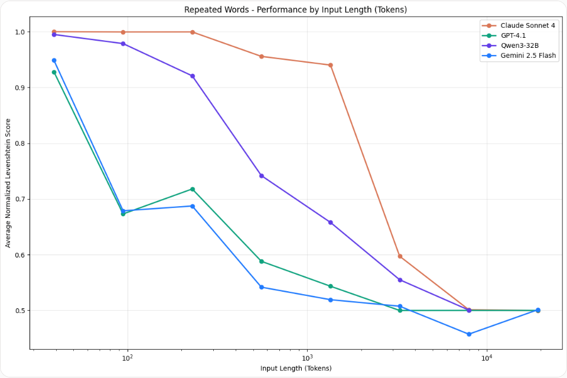
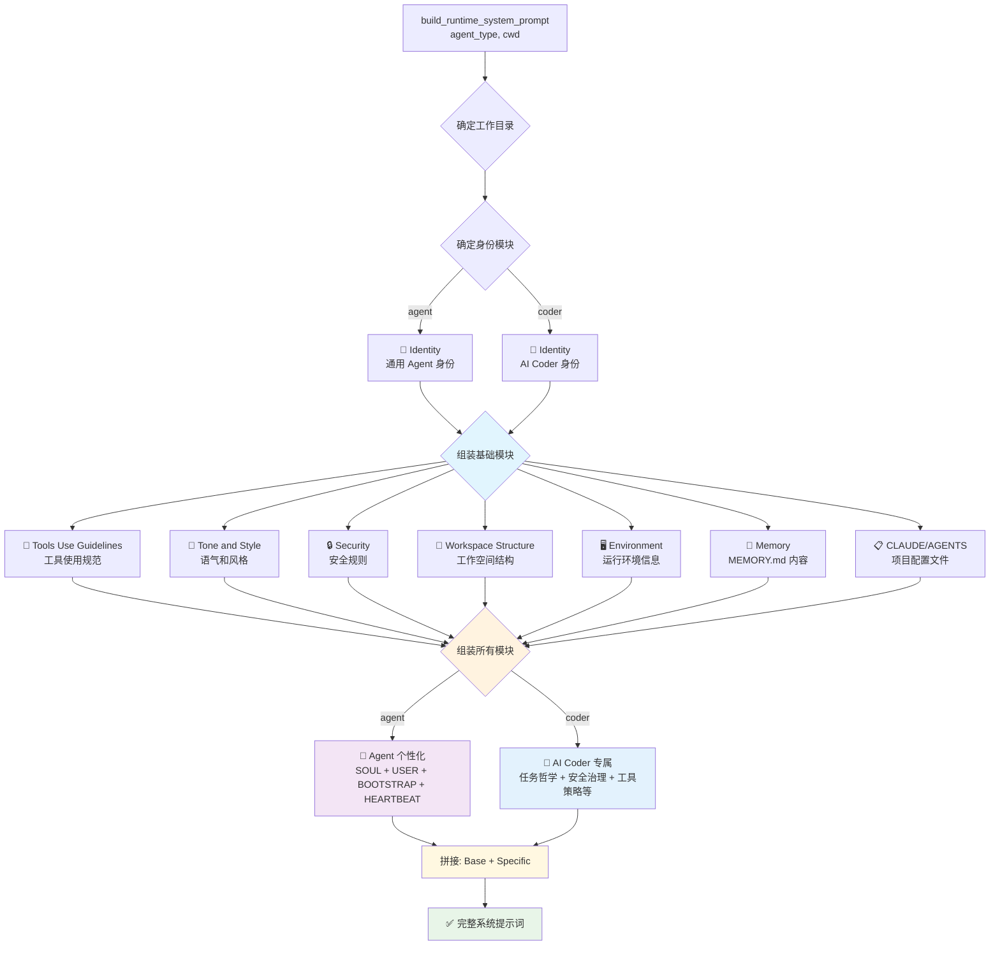

# Harness 中的上下文架构
## 一、引言
### 1.1 问题背景：当上下文成为瓶颈

在传统软件开发中，程序员通过阅读代码、理解需求、查阅文档来完成复杂任务。这个过程中，人类的大脑可以灵活地筛选信息、聚焦重点——我们天然具备"忽略无关细节"的能力。

然而，当这个角色交给 AI Agent 时，问题变得棘手起来。

**第一个挑战是注意力的边界**。模型的上下文窗口虽然动辄十几万甚至上百万 token，但研究表明，随着上下文长度的增加，模型对早期信息的关注度会显著下降。这不是模型变笨了，而是"信号噪声比"在下降——无关信息稀释了真正重要的上下文。

**第二个挑战是上下文的"腐烂"**。在 Agent 执行任务的过程中，每一次工具调用、每一个 grep 结果、每一次文件读取，都会在上下文中留下残留。[上下文退化(Context Rot)](https://www.trychroma.com/research/context-rot)随之发生：关键信息被稀释、检索质量下降、推理质量降低。


**第三个挑战是成本**。上下文窗口就是金钱——更长的上下文意味着更高的 API 调用成本、更慢的推理速度、更有限的并发能力。在生产环境中，这意味着有限的吞吐量和高昂的运维成本。

于是，工程师们面临一个根本性的矛盾：

> **Agent 需要足够丰富的上下文来理解任务、做出正确决策；但过多、过杂的上下文反而会让 Agent 更容易出错、更慢、更贵。**

这就是上下文工程（Context Engineering）诞生的背景。

---

### 1.2 上下文工程的诞生

2025 年 6 月，Andrej Karpathy 在一次演讲中提出了一个当时看来颇为激进的观点：

> **"上下文工程比提示工程重要得多。"**

这句话的背后，是一个范式转变：**从"怎么跟模型说话"转向"让模型看到什么"。**

传统的 Prompt Engineering 关注的是如何措辞、如何结构化指令、如何few-shot learning。但上下文工程关注的是更底层的问题：**在 Agent 执行任务的每一步，它应该看到什么信息？这些信息如何存储、如何检索、如何在合适的时机呈现？** 这不是一个技巧，而是一个工程。


上下文工程的核心理念是：**知识应该被编译一次，然后持续维护，而不是每次都从头推导。**

就像编译器把高级语言编译成机器码一样，上下文工程把散乱的原始信息（代码、文档、聊天记录、工具输出）编译成结构化的、经过验证的、可快速检索的上下文片段。这些片段在 Agent 需要时以恰当的方式呈现，让 Agent 的每一次"思考"都建立在高质量的信息基础之上。

---

## 二、 Harness 中的上下文架构设计

Harness Engineering 作为 AI 时代系统设计的新范式，它不是把上下文当作一个"塞满就行"的大容器，而是当作一个**需要精心设计的动态系统**。

Harness 中的上下文架构由两部分组成：

| 部分 | 作用 |
|------|-----------|
| **模块化提示词加载** | 动态维护上下文环境 |
| **四级压缩管线** | 持续清理和压缩上下文环境 |

这套架构的最终目标是：**找到最小的高信噪比的Tokens，最大化预期输出**


### 2.1 模块化提示词加载

模块化提示词加载是上下文架构中的重要组成部分，它的作用是动态维护上下文环境。它决定了哪些信息被选取、被加载。

#### 2.1.1 提示词组成

提示词是 Agent 理解任务、执行操作的依据。Harness 将提示词组成划分为两个层次：**基础信息**（所有 Agent 必须加载）和**个性化信息**（因定位不同而差异化的加载策略）。

---

**基础信息**

基础信息是每个 Agent 必须加载的核心内容，为 Agent 运行提供基本依据。

| 类型 | 说明 |
|------|------|
| 身份定义 | Agent 扮演的角色 |
| 工作空间 | Agent 任务执行的文件路径 |
| 运行环境 | 时间、时区、操作系统等 |
| 语气和风格 | Agent 输出原则 |
| 安全提示 | 防范提示注入攻击、对抗样本、后门攻击等 |
| 工具定义 | 工具名称、描述和 JSON Schema |
| Skill | Skill 名称、描述、所需依赖和 `SKILL.md` 的文件路径 |
| MEMORY.md | 用户长期偏好、提取到的重要事实等 |
| CLAUDE.md / AGENTS.md | 项目的简要描述和索引（建议控制在 100 行以内，仅作为索引） |


> **说明**：`CLAUDE.md` / `AGENTS.md` 一般控制在 100 行以内，**只作为索引指向其他文件**，而非直接承载全部项目信息。

---

**个性化信息**

不同的 Agent 定位决定了个性化信息的差异。市场上存在两类主流 Agent：

| Agent 类型 | 代表产品 | 核心定位 |
|------------|---------|----------|
| 个人 AI 助理 | OpenClaw、Nanobot、Hermes | 长期陪伴型，需要明确身份、性格，了解用户偏好和习惯 |
| AI Coder | Claude Code、Codex、OpenCode | 代码助手型，专注任务执行，强调软件工程能力 |

**个人 AI 助理**除了加载基础信息外，还需要以下个性化内容：

| 类型 | 说明 |
|------|------|
| SOUL.md | Agent 性格设定 |
| USER.md | 用户偏好和习惯 |
| BOOTSTRAP.md | Agent 引导信息 |
| HEARTBEAT.md | 定期检测清单 |

**AI Coder** 则需要针对代码任务增加专项配置，加载的内容更为丰富：

| 类型 | 说明 |
|------|------|
| 任务执行哲学 | 在软件工程语境下理解指令，遵循务实实践：先读后改、少创建文件、不估算时间、注意安全；避免过早抽象、不必要的添加和错误处理 |
| 操作安全与风险治理 | 评估操作可逆性和影响范围；可自由执行本地可逆操作；对破坏性操作（影响共享系统、难以逆转）需用户确认；不以破坏性操作作为捷径；仅协助授权安全测试和防御性安全 |
| Sub-Agent 架构与委派 | fork 用于中间输出不值得保留的场景（共享缓存、不窥视、不竞赛、简洁指令）；编写子代理提示词时区分继承上下文与全新子代理；worker 应精确实现、测试、报告结果、不假设；跨对话构建领域特定内存知识；线程使用绝对路径、一致格式、无 emoji |
| 工具选择与使用策略 | 优先使用专用工具（Read / Glob / Grep / Edit / Write）而非 Bash；简单定向搜索用 Glob / Grep；复杂探索用 Task；斜杠命令通过 Skill；用 TodoWrite 追踪进度；Bash 专用于系统命令 |
| 输出规范 | 引用代码包含 `file_path:line_number`；保持响应简短简洁；先回答后推理；独立操作使用并行工具调用 |
| 功能模式 | **Auto Mode**：立即执行、最小化中断、优先行动、预期修正、破坏性操作需确认；**Learning Mode**：协作鼓励，要求用户贡献 2-10 行设计决策代码 |
| 上下文压缩与内存管理 | 生成捕获基本上下文的结构化摘要以减少 token；部分压缩时保留：完成内容、关键决策、当前状态、下一步 |
| 专项能力与工具指令 | Git 状态为时间快照不更新；Scratchpad 用于中间文件和临时制品；MCP 长输出用直接查询或子代理分析 |
| 安全监控 | 审查用户定义的自动模式规则；根据阻止/允许规则评估自主代理操作 |
| 环境特定 | PowerShell 5.1 信息；避免不必要 sleep 命令 |
| 协作与通信 | Swarm 中的队友通信协议 |
| 计划模式 | 计划模式第四阶段；远程计划模式注入提醒，探索代码库、生成图表计划并实现 |
| 高级功能 | 会话转换为技能；hooks 配置 |
| 限制处理 | 工具执行被拒绝时的系统提示词 |
| 工具特定 | Chrome 浏览器 MCP 工具加载；浏览器自动化工具使用规范 |

#### 2.1.2 模块加载顺序

很少有教程关注模块加载顺序，但良好的加载顺序可以提高 **KV Cache** 命中率，显著降低 API 调用成本。

> **基本原则：长期不变的内容在顶部，经常变化的内容在底部**

LLM 的 KV Cache 基于**位置**进行复用。当模型看到"第 100 个 token"时，它实际上是在复用第 1-99 个 token 计算结果。如果每次请求的顶部内容都相同，缓存命中率就高；如果顶部内容频繁变化，缓存就容易失效。

---

**长期不变的内容（顶部）**

这类内容一旦确定就不会频繁修改，适合放在提示词最顶部：

| 优先级 | 内容 | 理由 |
|--------|------|------|
| ★★★ | 身份定义 | Agent 的角色定位是最核心的标识，几乎不变 |
| ★★★ | 任务执行哲学 | AI Coder 的核心做事原则，一旦确立很少改动 |
| ★★★ | 操作安全与风险治理 | 安全规则是底线，稳定性优先 |
| ★★★ | 输出规范 | 代码引用格式、响应风格等规范一旦约定就不变 |
| ★★☆ | 语气和风格 | Agent 输出原则相对稳定 |
| ★★☆ | 安全提示 | 防范提示注入、后门攻击等规则是长期策略 |
| ★★☆ | Sub-Agent 架构与委派 | Fork/Worker 模式一旦定义就是架构级约束 |
| ★★☆ | 工具选择与使用策略 | 专用工具 vs Bash 的选择原则是长期最佳实践 |
| ★★☆ | 上下文压缩与内存管理 | 压缩策略是系统性设计，不轻易改变 |
| ★★☆ | 安全监控 | 自主代理的阻止/允许规则是长期安全策略 |

**经常变化的内容（底部）**

这类内容需要频繁更新或因任务而异，适合放在提示词底部：

| 优先级 | 内容 | 理由 |
|--------|------|------|
| ★★★ | MEMORY.md | 用户偏好和重要事实随使用持续积累和更新 |
| ★★★ | 当前任务状态 | 正在执行的任务、进度、待办事项随时变化 |
| ★★★ | 工具执行结果 | grep/Read 等工具的输出是实时产生的 |
| ★★☆ | CLAUDE.md / AGENTS.md | 虽然是项目索引，但指向的具体文件内容可能更新 |
| ★★☆ | Scratchpad 内容 | 中间文件和临时制品随任务推进而变化 |
| ★★☆ | 功能模式 | Auto Mode / Learning Mode / Buddy Mode 因场景切换 |
| ★★☆ | 计划模式状态 | 远程规划会话的配置随任务进展而调整 |
| ★★☆ | 环境特定信息 | PowerShell 版本等环境信息可能随切换而变化 |
| ★★☆ | 专项能力与工具指令 | Git 状态快照、具体的工具使用偏好等动态信息 |
| ★☆☆ | HEARTBEAT.md | 定期检测清单可能随健康检查节奏更新 |

---

**示例加载顺序**

```
┌─────────────────────────────────────────────────────────────┐
│  TOP（高缓存命中率）                                        │
│  ────────────────────────────────────────────────────────  │
│  身份定义                                                   │
│  任务执行哲学                                               │
│  操作安全与风险治理                                         │
│  Sub-Agent 架构与委派                                       │
│  工具选择与使用策略                                         │
│  输出规范                                                  │
│  语气和风格                                                │
│  安全提示                                                  │
│  上下文压缩与内存管理                                       │
├─────────────────────────────────────────────────────────────┤
│  BOTTOM（低缓存命中率）                                      │
│  ────────────────────────────────────────────────────────  │
│  功能模式（当前是 Auto Mode）                               │
│  当前任务状态（实现 X 功能，进度 60%）                      │
│  MEMORY.md（用户偏好：不要用 Redux）                        │
│  工具执行结果（最近的 grep / Read 输出）                    │
│  Scratchpad 内容                                           │
└─────────────────────────────────────────────────────────────┘
```

这种分层加载策略让 **80% 的稳定内容享受高缓存命中率，仅 20% 的动态内容每次重新计算**，在保证 Agent 理解能力的同时最大化成本效率。

### 2.2 四级上下文压缩管线

上下文压缩解决**上下文超出LLM上下文窗口限制、Agent 记忆退化和Agent 在上下文过长时出现的焦虑行为**。上下文压缩并不是单一的LLM处理，而是一个**多层级递进式的压缩流水线**。根据令牌压力的严重程度以及待清理数据的具体特性，在三个压缩层级之间进行切换。

1. **Microcompact** - 每次请求前的轻量级工具结果清理
2. **Session Memory compaction** - 自动压缩时优先尝试的会话内存摘要
3. **Full compaction** - 完整对话摘要

#### 2.2.1 微压缩 (`microcompact`) — 每次请求
> 微压缩在每次 API 调用前执行，按工具类型白名单，保留最近N个工具结果，把更早的结果清理掉。这些工具输出通常很大但是时效性很短。优势在于零 API 调用，成本低。
- **工具白名单**
    - FileRead
    - Bash
    - Grep
    - Glob
    - WebSearch
    - WebFetch
    - FileEdit
    - FileWrite
---
但是直接全部清理会导致服务端的缓存失效，为了解决这一问题提供了两种实现路径。<br>
**两种微压缩路径**：

1. **基于时间的微压缩**: 
   - 用户离开一段时间后失效
   - 当距上次助手消息的时间超过阈值（默认60分钟）时触发
   - 服务器端缓存已过期，清空旧工具结果内容，保留最近 N 个
   - 直接修改消息内容，将工具调用结果直接替换为 `[{tool_name} used]`

2. **缓存微压缩** 
   - 用户连续会话中生效
   - 使用 `cache_edits` API 删除工具结果
   - **不修改**本地消息内容
   - 保持缓存前缀有效，避免重写
   - 只对主线程生效，不删除子Agent的工具结果

#### 2.2.2 会话记忆压缩 (`sessionMemoryCompact`) — 自动压缩优先尝试
> 微压缩是删除工具结果保留提示词前缀，会话记忆压缩是提取结构化事实(项目结构、用户偏好、任务进度)持久化到记忆文件。优势在于零API调用，用已经提取的结构化记忆替代摘要，成本低，且保留最近原始消息的完整细节。
1. 检查 `lastSummarizedMessageId` 确定已摘要的消息边界
2. 计算需要保留的消息起始索引，同时满足最小Tokens和最小消息数，或最大Tokens
3. 调整索引以保持 `tool_use/tool_result` 配对完整
4. 使用会话记忆内容作为摘要

#### 2.2.3 完整压缩 (`compactConversation`) — 传统摘要压缩

> 当会话记忆压缩不可用或不够用时触发，调用 API 生成对话摘要，创建压缩边界标记。

**压缩流程**：

1. 剥离图像（避免压缩请求本身超长）
2. 调用模型按照**用户请求和意图、关键技术概念、文件和代码片段、错误和修复、问题解决过程、所用用户消息、待办任务、当前工作和可选的下一步**生成对话摘要，输出格式要求包含'<analysis>'和'<summary>'标签，<analysis>标签的作用是让模型在生成摘要之前**想清楚**，但实际仅提取<summary>标签内容
3. 清除文件状态缓存
6. 创建压缩边界标记
7. 生成摘要消息
8. 创建压缩后附件（文件状态、工具增量等）
9. 重新注入最近文件（<= 5个 or 5w tokens）、Plan 文件、Skill 内容、MCP 工具说明、Agent 列表

## 三、在 Good Harness 中的实践:上下文架构
本节将详细介绍 Good Harness 中的上下文架构实践。我们将从整体代码文件结构，快速启动指南，核心数据类定义，提示词加载和上下文压缩依此介绍。

## 3.1 代码文件结构

Good Harness 的上下文架构代码位于 `01_agent module/context/code` 目录下，采用模块化设计：

```
code/
├── .harness/                         # Harness 工作空间
│   ├── data/
│   │   ├── memory/                    # 持久化记忆存储
│   │   └── session/                   # 会话数据存储
│   ├── skills/                       # 技能定义
│   │   ├── browser/                  # 浏览器自动化技能
│   │   ├── docx/                     # Word 文档技能
│   │   ├── pdf/                      # PDF 处理技能
│   │   ├── pptx/                     # PPT 处理技能
│   │   ├── skill-creator/            # 技能创建器
│   │   └── xlsx/                     # Excel 处理技能
│   ├── workspace/                    # 工作区配置
│
├── compact/                          # 上下文压缩模块
│   ├── __init__.py
│   ├── api_context.py               # API 上下文管理
│   ├── compaction.py                # 完整压缩实现
│   ├── grouping.py                  # 消息分组
│   ├── microcompact.py             # 微压缩实现
│   ├── models.py                    # 数据模型
│   ├── prompt.py                    # 压缩提示词
│   ├── session_memory.py           # 会话记忆压缩
│   ├── token_estimation.py         # Token 估算
│   └── test_compact.py             # 测试
│
├── template/                        # 模板目录
│   ├── docx/
│   ├── pdf/
│   ├── pptx/
│   ├── skill-creator/
│   └── xlsx/
│
├── .env                             # 环境变量配置
├── .gitignore
├── environment.py                   # 获取运行时环境
├── prompt.py                        # 提示词构建
├── runtime.py                       # Agent Loop
├── session.py                       # 会话管理
└── requirements.txt                 # 依赖环境  
```

### 核心模块说明

| 目录/文件 | 说明 |
|-----------|------|
| `compact/` | 四级压缩管线的实现，包含 microcompact、session_memory、compaction |
| `.harness/` | Harness 运行时环境，配置技能、数据存储、工作区 |
| `runtime.py` | Agent 循环核心，实现提示词构建、工具调用、消息保存 |
| `session.py` | 会话状态管理 |
| `prompt.py` | 模块化提示词构建逻辑 |
| `environment.py` | 环境配置和初始化 |

## 3.2 快速启动
1. cd 到 `01_agent module/context/code` 目录下
2. 创建一个名为 `.env` 的文件，并添加以下内容：
```bash
ANTHROPIC_API_KEY="<your_api_key>"
ANTHROPIC_BASE_URL="<base_url>"
MODEL_ID="<model_name>"
```
**注:目前仅支持兼容 Anthropic API 的模型，您可以使用 `minimax` `glm` `kimi`等。**
3. 下载依赖包
```bash
pip install -r requirements.txt
```
4. 运行程序
```bash
python runtime.py
```

## 3.3 核心数据类定义

在设计上下文架构时，我们需要定义一套统一的数据模型来表示 Agent 与用户、工具之间的交互消息。这些数据类位于 `compact/models.py`，是整个上下文架构的基础。


### 3.3.1 消息类（核心数据结构）

`Message` 是最核心的数据类，它用于定义模型接收和返回的消息，最简单的只需要 role 和 content 属性，但为了辅助上下文压缩，我们添加了额外的属性 `id` 和 `timestamp` 。

```python
@dataclass
class Message:
    content: Union[str, list]  # 消息内容，可以是字符串或块列表
    role: str = ""  # 角色："user", "assistant", "system", "tool"
    id: str = ""  # 消息的唯一标识符
    timestamp: str = ""  # ISO 格式时间戳

    def __post_init__(self):
        # 如果没有提供 id，自动生成一个 UUID
        if not self.id:
            self.id = str(uuid.uuid4())
        # 如果没有提供时间戳，自动使用当前时间
        if not self.timestamp:
            self.timestamp = datetime.datetime.now().isoformat()

    def is_assistant(self) -> bool:
        """判断是否是对话助手的消息"""
        return self.role == "assistant" or self.type == "assistant"

    def is_user(self) -> bool:
        """判断是否是用户的消息"""
        return self.role == "user" or self.type == "user"
```

### 3.3.2 压缩元数据类

**`CompactMetadata`** - 记录压缩操作的信息：

```python
@dataclass
class CompactMetadata:
    boundary_type: str = ""  # 压缩类型："auto"（自动）或 "manual"（手动）
    pre_compact_token_count: int = 0  # 压缩前的 token 数量
    last_message_uuid: str = ""  # 最后一条消息的 UUID
```

**`CompactionResult`** - 记录压缩操作的结果：

```python
@dataclass
class CompactionResult:
    messages: list  # 压缩后的消息列表
    boundary_marker: Optional[Message] = None  # 压缩边界标记
    summary: str = ""  # 压缩生成的摘要
    tokens_saved: int = 0  # 节省的 token 数量
```

---

## 3.4 提示词加载

> 系统提示词不是一段介绍文字，是 Agent 的操作系统，它定义了 Agent 的身份、能力、边界、行为规范和风险判定框架，写的越详细，Agent 的行为越可控。
Harness 以**模块化**的方式，组装系统提示词，这些模块包括：身份、工作区、运行环境、工具使用指南、语气和风格、安全、技能、记忆、 CLAUDE/AGENTS 和个性化提示。

### 3.4.1 提示词模板结构

提示词由以下部分组成（对应 `prompt.py`）：

```python
_BASE_SYSTEM_PROMPT = """
# Identity
{identity}

# Workspace
{workspace}

# Workspace Structure
{workspace_structure}

# Running Environment
{environment}

# Tools Use Guidelines
{tools_guidelines}

# Tone and Style
{tone_and_style}

# Security
{security_rules}

# Skills
{skills}

# Memory
{memory}

# CLAUDE/AGENTS
{agents}
"""
```

### 3.4.2 身份定义

身份定义告诉 Agent "它是谁"。有两种预设身份：通用Agent（类似Openclaw）和AI Coder（类似 Claude Code）：

**通用 Agent 身份**：
```python
_BASE_AGENT_IDENTITY_PROMPT = """
You are gh, a personal agent built on top of GoodHarness.
"""
```

**AI Coder 身份**：
```python
_BASE_AI_CODER_IDENTITY_PROMPT = """
You are ai-coder, a personal assistant built on top of GoodHarness.
"""
```

### 3.4.3 提示词构建函数

`build_runtime_system_prompt()` 是核心构建函数：

```python
def build_runtime_system_prompt(
    agent_type: Literal['agent', 'coder'] = 'agent',
    cwd: str | Path = None
) -> str:
    """
    构建运行时系统提示词

    Args:
        agent_type: Agent 类型，'agent' 或 'coder'
        cwd: 工作目录路径

    Returns:
        组装好的完整系统提示词
    """
    if cwd is None:
        cwd = _default_cwd()

    # 根据类型选择身份模板
    identity = _BASE_AGENT_IDENTITY_PROMPT if agent_type == 'agent' else _BASE_AI_CODER_IDENTITY_PROMPT

    # 根据类型选择特定提示词
    specific = _BASE_AI_CODER_PROMPT if agent_type == 'coder' else build_agent_prompt(cwd)

    # 组装所有部分
    return _BASE_SYSTEM_PROMPT.format(
        identity=identity,
        workspace=cwd,
        workspace_structure=_build_workspace_structure(cwd),
        environment=format_environment_section(get_environment_info(cwd)),
        skills=build_skills_body(cwd),
        memory=get_mermory_section(cwd),  # 注意：函数名有拼写错误（mermory）
        agents=get_agents_section(cwd),
    ) + "\n\n" + specific
```

**流程图：**



**加载模块说明：**

| 模块类别 | 具体内容 | 适用类型 |
|----------|----------|----------|
| **🔷 身份模块** | Identity（通用 Agent 或 AI Coder） | 通用 |
| **基础模块** | Tools Use Guidelines、Tone and Style、Security、Workspace Structure、Environment、Memory、CLAUDE/AGENTS | 通用 |
| **💜 Agent 个性化** | SOUL.md、USER.md、BOOTSTRAP.md、HEARTBEAT.md | agent |
| **💙 AI Coder 专属** | 任务执行哲学、操作安全与风险治理、工具选择策略、输出规范等 | coder |

### 3.4.4 工作空间结构描述
在系统提示词中添加工作空间结构描述，让 Agent 明确知道可用资源的位置（如 skills/ 加载技能、workspace/MEMORY.md 持久化偏好）、文件应存放的位置，以及哪些可选配置尚未创建，从而避免 Agent 随意命名文件路径、不知道去哪读写数据，确保Agent行为符合项目规范。

`_build_workspace_structure()` 函数生成工作空间的目录结构说明：

```python
def _build_workspace_structure(cwd: Path = None) -> str:
    """构建工作空间结构说明"""
    if cwd is None:
        cwd = _default_cwd()
    if not cwd.exists():
        return ".harness/ (not found)"

    entries = [
        ("data/memory/", "Persistent memory storage for agent"),
        ("data/session/", "Session history storage"),
        ("skills/", "Available skills for agent"),
        ("workspace/AGENTS.md", "Agent configuration and instructions"),
        ("workspace/BOOTSTRAP.md", "First contact and onboarding script"),
        ("workspace/CLAUDE.md", "CLAUDE agent-specific instructions"),
        ("workspace/HEARTBEAT.md", "Agent status and heartbeat"),
        ("workspace/MEMORY.md", "Memory index and durable notes"),
        ("workspace/SOUL.md", "Agent identity and core values"),
        ("workspace/USER.md", "User profile and preferences"),
    ]

    lines = []
    for path, desc in entries:
        full_path = cwd / path
        if full_path.exists():
            lines.append(f"- {path}: {desc}")
        else:
            lines.append(f"- {path}: (not created yet)")

    return "\n".join(lines)
```

### 3.4.5 技能加载

技能（Skills）为 Agent 扩展专业能力，缓解上下文爆炸的问题，每一个 skill 对应一个 `SKILL.md` 文件，该文件由元数据和正文组成，元数据提供了skill 的名称、描述、依赖配置，在系统提示词加载时会扫描所有的 `SKILL.md` 文件，获取元数据并组装成 xml 块，xml 块的优势在于易于解析和动态替换。

`build_skills_body()` 函数扫描 `skills/` 目录，加载所有 `SKILL.md` 文件：

```python
def build_skills_body(cwd: Path = None):
    """构建技能说明部分"""
    if cwd is None:
        cwd = _default_cwd()
    skills_dir = cwd / "skills"
    if not skills_dir.exists():
        return "No skills detected."

    def parse_skill_md(file_path: Path) -> dict:
        """解析 SKILL.md 的 frontmatter"""
        try:
            content = file_path.read_text(encoding="utf-8")
            if "---" not in content:
                return None
            frontmatter = content.split("---", 2)[1].strip()
            result = {}
            for line in frontmatter.splitlines():
                if ":" in line:
                    k, v = line.split(":", 1)
                    result[k.strip()] = v.strip()
            if "name" not in result:
                return None
            return {
                "name": result.get("name", ""),
                "description": result.get("description", ""),
                "path": str(file_path)
            }
        except Exception:
            return None

    # 递归搜索所有 SKILL.md 文件
    skills = [s for f in skills_dir.rglob("SKILL.md") if (s := parse_skill_md(f))]
    if not skills:
        return "No skills detected."

    # 生成 XML 格式的技能列表
    return "\n".join([
        "<skills>"
    ] + [
        f'  <skill name="{x["name"]}" description="{x["description"]}" path="{x["path"]}" />'
        for x in skills
    ] + ["</skills>"])
```

### 3.4.6 个性化提示词（Agent 类型）

对于 `agent` 类型的 Agent，还有额外的个性化提示词：

```python
_BASE_AGENT_PROMPT = """
# SOUL
{soul}

# User Profile
{user_profile}

# Bootstrap
{bootstrap}

# Heartbeat
{heartbeat}
"""
```

这些内容从工作区的 `workspace/` 目录读取：
- `SOUL.md` - Agent 的性格和价值观
- `USER.md` - 用户偏好和习惯
- `BOOTSTRAP.md` - 首次接触引导
- `HEARTBEAT.md` - 定期状态检测

### 3.4.7 工具定义

在 `runtime.py` 中定义了 Agent 可用的工具：

```python
TOOLS = [
    {
        "name": "bash",
        "description": "Run a shell command.",
        "input_schema": {
            "type": "object",
            "properties": {"command": {"type": "string"}},
            "required": ["command"]
        }
    },
    {
        "name": "read_file",
        "description": "Read file contents.",
        "input_schema": {
            "type": "object",
            "properties": {"path": {"type": "string"}, "limit": {"type": "integer"}},
            "required": ["path"]
        }
    },
    # ... write_file, edit_file 类似定义
]
```

工具通过 JSON Schema 定义输入参数格式，Agent 根据 Schema 构造调用请求。

### 3.4.8 环境信息

`environment.py` 中的 `get_environment_info()` 函数收集运行环境信息：

```python
@dataclass
class EnvironmentInfo:
    os_name: str          # 操作系统名称
    os_version: str       # 操作系统版本
    platform_machine: str # CPU 架构
    shell: str            # 使用的 Shell
    cwd: str              # 当前工作目录
    home_dir: str         # 用户主目录
    date: str             # 当前日期
    python_version: str   # Python 版本
    python_executable: str # Python 解释器路径
    virtual_env: str | None  # 虚拟环境路径
    is_git_repo: bool     # 是否在 Git 仓库中
    git_branch: str | None  # Git 分支名
    hostname: str          # 主机名
```

这些信息会在系统提示词的环境部分呈现给 Agent。

---

## 3.5 上下文压缩

上下文压缩解决模型上下文窗口限制，避免上下文腐蚀的关键机制。Good Harness 实现了**四级递进式压缩管线**。

### 3.5.1 压缩管线概览

```
┌─────────────────────────────────────────────────────────┐
│                    输入: 消息列表                        │
└─────────────────────────────────────────────────────────┘
                          │
                          ▼
┌─────────────────────────────────────────────────────────┐
│  Tier 1: Microcompact（微压缩）                          │
│  - 时机: 每次 API 调用前                                 │
│  - 成本: 零 API 调用                                     │
│  - 原理: 基于时间间隔清理旧工具结果                       │
│  - 实现: 两种路径——时间触发 vs 缓存触发                  │
└─────────────────────────────────────────────────────────┘
                          │
                          ▼
┌─────────────────────────────────────────────────────────┐
│  Tier 2: Session Memory Compaction（会话记忆压缩）       │
│  - 时机: Token 数超过阈值时优先尝试                      │
│  - 成本: 零 API 调用                                     │
│  - 原理: 用预提取的结构化事实替代原始消息                 │
│  - 持久化: .harness/data/memory/{session_id}.md        │
└─────────────────────────────────────────────────────────┘
                          │
                          ▼
┌─────────────────────────────────────────────────────────┐
│  Tier 3: Full Compaction（完整压缩）                    │
│  - 时机: 前两层无法完成时                                │
│  - 成本: 一次 LLM API 调用                               │
│  - 原理: 调用 LLM 生成对话摘要                           │
│  - 附件: 压缩后重新注入最近文件、Plan、Skills 等         │
└─────────────────────────────────────────────────────────┘
                          │
                          ▼
┌─────────────────────────────────────────────────────────┐
│                    输出: 压缩后的消息列表                  │
└─────────────────────────────────────────────────────────┘
```

### 3.5.2 Tier 1：微压缩（Microcompact）

微压缩位于 `compact/microcompact.py`，它在每次 API 调用前执行，清理旧的工具结果。

**压缩流程**：
1. 检查最后一条助手消息的时间，计算时间间隔，判断是否触发压缩（默认时间间隔 60 分钟）
2. 遍历消息，识别工具调用名称，对比工具白名单，删除旧工具调用结果
3. 保留最近N个工具调用信息
4. 返回压缩结果

**工具白名单**：
这些工具的共同特征是具有时效性，一旦用户离开一段时候后再回来，这些工具的结果就没有意义了。
```python
COMPACTABLE_TOOLS: Set[str] = {
    "read_file",
    "edit_file",
    "write_file",
    "bash",
    "grep",
    "glob",
    "WebSearch",
    "WebFetch",
}
```

**默认配置**：

```python
DEFAULT_TIME_BASED_CONFIG = {
    "enabled": True,
    "gap_threshold_minutes": 60,  # 60分钟间隔
    "keep_recent": 5,             # 保留最近5个工具结果
}
```

**触发条件判定**：

```python
def evaluate_time_based_trigger(messages, query_source=None):
    """检查是否满足时间触发条件"""
    config = get_time_based_config()

    # 仅对主线程生效
    if query_source and not query_source.startswith("repl_main_thread"):
        return None

    # 找到最后一条助手消息
    last_assistant = find_last_assistant_message(messages)
    if not last_assistant:
        return None

    # 计算时间间隔
    timestamp = last_assistant.get("timestamp", "")
    last_time = datetime.datetime.fromisoformat(timestamp).timestamp()
    gap_minutes = (time.time() - last_time) / 60

    # 超过阈值则触发
    if gap_minutes < config.get("gap_threshold_minutes", 1):
        return None

    return {"gap_minutes": gap_minutes, "config": config}
```

**清理逻辑**：

```python
def maybe_time_based_microcompact(messages, query_source=None):
    """执行时间-based 微压缩"""
    trigger = evaluate_time_based_trigger(messages, query_source)
    if not trigger:
        return None

    config = trigger["config"]
    keep_recent = max(1, config.get("keep_recent", 3))

    # 收集所有可压缩的工具调用 ID
    compactable_ids = collect_compactable_tool_ids(messages)

    # 保留最近 N 个，其余标记为清理
    keep_set = set(compactable_ids[-keep_recent:])
    clear_set = set(id for id in compactable_ids if id not in keep_set)

    TIME_BASED_MC_CLEARED_MESSAGE = "[Old tool result content cleared]"

    def clear_block(block):
        """清理工具结果块"""
        if block.get("type") != "tool_result":
            return block
        if block.get("tool_use_id") not in clear_set:
            return block
        return {**block, "content": TIME_BASED_MC_CLEARED_MESSAGE}

    # 遍历消息，应用清理（保持不可变性）
    result = []
    for msg in messages:
        content = msg.get("content", []) if isinstance(msg, dict) else getattr(msg, "content", [])
        if isinstance(content, list):
            new_content = [clear_block(b) if isinstance(b, dict) else b for b in content]
            if isinstance(msg, dict):
                result.append({**msg, "content": new_content})
            else:
                new_msg = object.__new__(type(msg))
                new_msg.__dict__.update(msg.__dict__.copy())
                new_msg.content = new_content
                result.append(new_msg)
        else:
            result.append(msg)

    return result
```

### 3.5.3 Tier 2：会话记忆压缩

会话记忆压缩位于 `compact/session_memory.py`，利用预提取的结构化事实来替代原始消息。会话记忆通过后台Agent预先提取并持久化到文件，压缩时直接使用，无需调用 API。
**压缩流程**：
1. 预先提取结构化事实
1.1 每轮会话结束，计算Tokens用量
1.2.1 初始化会话记忆文件需满足 Tokens>=20000
1.2.2 更新会话记忆文件需满足 Tokens>=5000 且 工具调用次数 >= 10
1.3 启动后台Agent抽取结构化事实并保存到 `./harness/data/memory` 目录下
2. 会话记忆压缩
2.1 读取会话记忆文件
2.2 从会话记忆文件中获取最后一条消息的ID
2.3 从该消息向上扩展，直到同时满足最小Tokens和最小消息数，或超过最大Tokens，保留最近N条消息
2.4 将历史消息替换成会话摘要并重新注入最近N条消息
2.5 返回压缩后的结果


**会话记忆数据结构**：

```python
@dataclass
class SessionMemory:
    """Structured session memory for Tier 2 compaction."""
    session_id: str
    title: str = ""                    # 5-10字会话标题
    current_state: str = ""            # 当前工作状态
    task_specification: str = ""       # 用户任务需求
    implementation_notes: str = ""     # 技术实现笔记
    important_context: str = ""        # 重要上下文（错误修复、用户偏好等）
    next_steps: str = ""               # 后续步骤
    last_summarized_message_id: Optional[str] = None  # 上次摘要的消息ID
    created_at: str = ""
    updated_at: str = ""

    def to_markdown(self) -> str:
        """序列化为 markdown 格式"""
        sections = [
            f"# Session Memory: {self.session_id}",
            f"## Title\n{self.title or 'N/A'}",
            f"## Current State\n{self.current_state or 'N/A'}",
            f"## Task Specification\n{self.task_specification or 'N/A'}",
            f"## Implementation Notes\n{self.implementation_notes or 'N/A'}",
            f"## Important Context\n{self.important_context or 'N/A'}",
            f"## Next Steps\n{self.next_steps or 'N/A'}",
            f"---\nlast_summarized_message_id: {self.last_summarized_message_id or 'None'}",
            f"created_at: {self.created_at}",
            f"updated_at: {self.updated_at}",
        ]
        return "\n\n".join(sections)
```

**持久化路径**：`{cwd}/.harness/data/memory/{session_id}.md`

**配置参数**：

```python
# 提取触发阈值
EXTRACTION_INIT_THRESHOLD = 20000    # 初始提取触发阈值
EXTRACTION_UPDATE_THRESHOLD = 5000   # 更新提取阈值
EXTRACTION_MIN_TOOL_CALLS = 10      # 最小工具调用数

# 压缩配置
DEFAULT_SM_CONFIG = {
    "min_tokens": 10000,           # 最小Tokens
    "min_text_block_messages": 5,   # 最少消息数
    "max_tokens": 40000,           # 最大Tokens
}
```

**会话记忆抽取提示词**：
```
基于上述用户对话内容（不含本条记录指令消息、系统提示、claude.md 条目及过往会话摘要），更新会话记录文件。

系统已为你读取路径为{notesPath}的文件，以下为文件当前内容：
<current_notes_content>
{currentNotes}
</current_notes_content>

你的**唯一任务**是使用编辑工具更新记录文件，完成后立即停止操作。可进行多项编辑（按需更新所有板块），需在单条消息中并行发起全部编辑工具调用，禁止调用其他工具。

### 编辑核心规则
- 文件必须保留原有完整结构，所有板块、标题、斜体说明文字保持原样
  - 严禁修改、删除、新增板块标题（以#开头的内容，如# 任务说明）
  - 严禁修改、删除各标题下方的斜体板块说明文字（首尾带下划线的斜体文本）
  - 斜体板块说明为固定模板指引内容，必须完全保留，用于规范各板块填写内容
  - 仅可修改各板块内、斜体说明文字下方的实际正文内容
  - 禁止在现有结构外新增板块、摘要或额外信息
- 记录内容中不得提及本次笔记整理流程与相关指令
- 若无实质性新增有效信息，可跳过对应板块更新；禁止填写暂无信息等无效占位内容，无内容则保留空白或不做修改
- 各板块内容需详实、信息密度充足，补充文件路径、函数名、报错信息、完整指令、技术细节等具体内容
- 关键成果板块需完整保留用户要求的全部原始输出内容（如完整表格、完整回复等）
- 不得写入上下文内CLAUDE.md文件已包含的重复信息
- 单个板块内容字数控制在约{MAX_SECTION_TOKENS}范围内，临近上限时精简次要信息，保留核心关键内容
- 内容聚焦可落地、具体化信息，便于他人理解或复现对话中的相关操作
- 务必同步更新「当前状态」板块，同步最新工作进度，保障会话压缩后的内容连续性

使用编辑工具，指定文件路径：{notesPath}

### 结构保留提醒
每个板块包含两项必须完全原样保留的内容：
1. 板块标题（以#开头的文本行）
2. 标题下方紧随的斜体说明行（首尾带下划线的斜体模板指引文字）

仅可修改以上两项固定内容之后的正文内容，首尾带下划线的斜体说明属于模板结构，禁止编辑与删除。

注意：并行使用编辑工具完成修改后即刻停止，仅整理用户实际对话中的有效信息，不得引用本条操作指令内容，严禁改动板块标题与斜体说明文本。

### 输出格式
完成编辑工具调用后，最终输出为标准Markdown文本，严格遵循以下固定格式：

# 会话记录：{session_id}

## 会话标题
_用5-10个词语概括本次会话内容_

## 当前状态
_记录正在开展的工作、最新进度与现状_

## 任务说明
_记录用户提出的需求、目标及具体要求_

## 实施备注
_记录核心技术决策、代码规范、文件路径、函数名称等内容_

## 重要背景
_留存关键信息：问题修复方案、用户使用偏好、临时解决办法等_

## 后续计划
_明确可执行的下一步操作及待完成工作_
```

**会话记忆抽取实现**：
```python
async def extract_session_memory(
    messages: List[Union[dict, object]],
    session_id: str,
    llm_client=None,
    model_id: str = "minimax-m2.7"
) -> Optional[SessionMemory]:
    """
    Extract structured session memory via LLM.

    Args:
        messages: Messages to extract from
        session_id: Session identifier
        llm_client: LLM client (uses mock if None)
        model_id: Model to use

    Returns:
        SessionMemory object or None on failure
    """
    if llm_client is None:
        return _mock_extract_session_memory(session_id, messages)

    from .compaction import strip_images_from_messages
    # 剥离图片
    stripped = strip_images_from_messages(messages)

    # 使用运行时变量格式化提示词
    notes_path = str(_get_memory_file_path(session_id))
    existing_memory = load_session_memory(session_id)
    current_notes = existing_memory.to_markdown() if existing_memory else ""

    # 获取最新消息ID
    last_msg_id = ""
    if messages:
        last_msg = messages[-1]
        last_msg_id = last_msg.get("id", "") if isinstance(last_msg, dict) else getattr(last_msg, "id", "")

    timestamp = datetime.datetime.now().isoformat()
    # 格式化提示词
    formatted_prompt = EXTRACTION_PROMPT.format(
        notesPath=notes_path,
        currentNotes=current_notes,
        MAX_SECTION_TOKENS=MAX_SECTION_TOKENS,
        session_id=session_id,
        message_id=last_msg_id,
        timestamp=timestamp,
    )

    api_messages = []
    for msg in stripped:
        if isinstance(msg, dict):
            role = msg.get("role", "")
            content = msg.get("content", "")
        else:
            role = getattr(msg, "role", "")
            content = getattr(msg, "content", "")

        if isinstance(content, list):
            content = _content_to_str(content)
        api_messages.append({"role": role, "content": content})
    api_messages.append({"role":"user","content":formatted_prompt})

    # 为抽取Agent提供 read_file 和 edit_file 工具，用于读取和写入会话记忆
    extraction_tools = [
        {
            "name": "read_file",
            "description": "Read file contents.",
            "input_schema": {
                "type": "object",
                "properties": {
                    "path": {"type": "string"},
                    "limit": {"type": "integer"}
                },
                "required": ["path"]
            }
        },
        {
            "name": "edit_file",
            "description": "Write content to a file.",
            "input_schema": {
                "type": "object",
                "properties": {
                    "path": {"type": "string"},
                    "content": {"type": "string"}
                },
                "required": ["path", "content"]
            }
        },
    ]

    max_tool_failures = 3
    tool_failures = 0

    try:
        response = llm_client.messages.create(
            model=model_id,
            system="Based on the user conversation above (EXCLUDING this note-taking instruction message as well as system prompt, claude.md entries, or any past session summaries), update the session notes file.",
            messages=api_messages,
            tools=extraction_tools,
            max_tokens=4096,
        )

        # Handle tool use loop
        while response.stop_reason == "tool_use":
            tool_results = []
            for block in response.content:
                if block.type == "tool_use":
                    tool_name = block.name
                    tool_input = block.input

                    try:
                        if tool_name == "read_file":
                            path = tool_input.get("path", "")
                            limit = tool_input.get("limit")
                            result = _safe_read_file(path, limit)
                        elif tool_name == "edit_file":
                            path = tool_input.get("path", "")
                            content = tool_input.get("content", "")
                            result = _safe_edit_file(path, content)
                        else:
                            result = f"Unknown tool: {tool_name}"
                    except Exception as e:
                        result = f"[Error: {type(e).__name__}] {e}"
                        tool_failures += 1

                    if tool_failures >= max_tool_failures:
                        return None

                    tool_results.append({
                        "type": "tool_result",
                        "tool_use_id": block.id,
                        "content": result,
                    })

            api_messages.append({"role": "assistant", "content": response.content})
            api_messages.append({"role": "user", "content": tool_results})

            response = llm_client.messages.create(
                model=model_id,
                system="Based on the user conversation above (EXCLUDING this note-taking instruction message as well as system prompt, claude.md entries, or any past session summaries), update the session notes file.",
                messages=api_messages,
                tools=extraction_tools,
                max_tokens=4096,
            )

        response_text = ""
        for block in response.content:
            if hasattr(block, "text"):
                response_text += block.text
            elif isinstance(block, dict) and block.get("type") == "text":
                response_text += block.get("text", "")
        
        # 提取结构化记忆
        memory = SessionMemory.from_markdown(session_id, response_text)
        memory.session_id = session_id
        memory.created_at = datetime.datetime.now().isoformat()
        memory.updated_at = datetime.datetime.now().isoformat()

        if messages:
            last_msg = messages[-1]
            memory.last_summarized_message_id = last_msg.get("id", "") if isinstance(last_msg, dict) else getattr(last_msg, "id", "")

        return memory

    except Exception as e:
        print(e)
        return None
```


**会话记忆压缩实现**：

```python
def try_session_memory_compaction(messages, session_id, auto_threshold=None):
    """尝试会话记忆压缩"""
    # 1. 加载持久化的会话记忆
    memory = load_session_memory(session_id)
    if not memory or is_session_memory_empty(session_id):
        return None

    # 2. 找到上次摘要的位置
    last_summarized_id = memory.last_summarized_message_id
    last_index = len(messages) - 1
    if last_summarized_id:
        for i, msg in enumerate(messages):
            msg_id = msg.get("id", "") if isinstance(msg, dict) else getattr(msg, "id", "")
            if msg_id == last_summarized_id:
                last_index = i
                break

    # 3. 计算需要保留的消息起始位置
    start_index = calculate_messages_to_keep_index(messages, last_index)

    # 4. 过滤掉边界标记消息
    result = [msg for msg in messages[start_index:] if not _is_compact_boundary(msg)]

    # 5. 在开头插入结构化摘要
    summary_parts = []
    if memory.title:
        summary_parts.append(f"## Session: {memory.title}")
    if memory.current_state:
        summary_parts.append(f"## Current State\n{memory.current_state}")
    if memory.task_specification:
        summary_parts.append(f"## Task\n{memory.task_specification}")
    if memory.implementation_notes:
        summary_parts.append(f"## Implementation\n{memory.implementation_notes}")
    if memory.important_context:
        summary_parts.append(f"## Context\n{memory.important_context}")
    if memory.next_steps:
        summary_parts.append(f"## Next Steps\n{memory.next_steps}")

    summary_content = "\n\n".join(summary_parts) if summary_parts else "[Session Memory]"
    summary_msg = {
        "role": "user",
        "content": f"[Session Memory Summary]\n\n{summary_content}",
    }
    result.insert(0, summary_msg)

    return result
```

**保留配对完整性**：

```python
def adjust_index_to_preserve_pairs(messages, start_index):
    """调整索引，确保不拆分 tool_use/tool_result 配对"""
    if start_index <= 0 or start_index >= len(messages):
        return start_index

    adjusted = start_index

    # 收集需要配对的 tool_result ID
    all_result_ids = []
    for i in range(start_index, len(messages)):
        all_result_ids.extend(get_tool_result_ids(messages[i]))

    if all_result_ids:
        needed = set(all_result_ids)
        # 向前搜索，找回缺失的 tool_use
        for i in range(adjusted - 1, -1, -1):
            if not needed:
                break
            msg = messages[i]
            if has_tool_use_with_ids(msg, needed):
                adjusted = i
                content = msg.get("content", []) if isinstance(msg, dict) else getattr(msg, "content", [])
                if isinstance(content, list):
                    for block in content:
                        if isinstance(block, dict) and block.get("type") == "tool_use":
                            needed.discard(block.get("id", ""))

    return adjusted
```

### 3.5.4 Tier 3：完整压缩

完整压缩位于 `compact/compaction.py`，当前两层都无法完成时调用。它需要一次 LLM API 调用来生成摘要。

**压缩流程**：
1. 剥离图像（避免压缩请求本身超长）
2. 调用模型按照**用户请求和意图、关键技术概念、文件和代码片段、错误和修复、问题解决过程、所用用户消息、待办任务、当前工作和可选的下一步**生成对话摘要，输出格式要求包含'<analysis>'和'<summary>'标签，<analysis>标签的作用是让模型在生成摘要之前**想清楚**，但实际仅提取<summary>标签内容
3. 清除文件状态缓存
6. 创建压缩边界标记
7. 生成摘要消息
8. 创建压缩后附件（文件状态、工具增量等）
9. 重新注入最近文件（<= 5个 or 5w tokens）、Plan 文件、Skill 内容、MCP 工具说明、Agent 列表

**压缩提示词设计**：

压缩提示词包含 9 个方面的考量，要求输出结构包含 `<analysis>` 和 `<summary>` 标签：

| # | 摘要字段 | 核心内容 | 设计目的 |
|---|----------|---------|---------|
| 1 | Primary Request and Intent | 用户的明确请求与目标 | 防止目标偏移 |
| 2 | Key Technical Concepts | 技术、框架、模式、语言特性 | 提供定位锚点 |
| 3 | Files and Code Sections | 文件、代码片段、函数签名 | 防止冗余文件读取 |
| 4 | Errors and Fixes | 错误、解决方案、用户纠正 | 防止重蹈覆辙 |
| 5 | Problem Solving | 已解决和进行中的问题 | 保持推进势头 |
| 6 | All User Messages | 逐字保留的用户消息 | 完整保留用户反馈 |
| 7 | Pending Tasks | 尚未完成的工作 | 防止任务遗漏 |
| 8 | Current Work | 当前精确工作描述 | 实现即时恢复 |
| 9 | Optional Next Step | 下一步及原话引用 | 减少重新定位时间 |

**完整压缩实现**：

```python
async def compact_conversation(
    messages,
    llm_client=None,
    model_id="minimax-m2.7",
    custom_instructions=None,
    cwd=None
):
    """完整对话压缩流程"""

    # 1. 记录压缩前的 token 数
    pre_token_count = rough_token_count_estimation_for_messages(messages)

    # 2. 规范化消息内容
    messages = [
        {**msg, "content": _normalize_content(msg.get("content") if isinstance(msg, dict) else getattr(msg, "content", []))}
        if isinstance(msg, dict) else msg
        for msg in messages
    ]

    # 3. 剥离图像（避免压缩请求本身超限）
    stripped = strip_images_from_messages(messages)

    # 4. 生成摘要
    if llm_client is None:
        summary = _generate_mock_summary(stripped)
    else:
        summary_messages = [_message_to_api_format(m) for m in stripped]
        prompt = get_compact_prompt(custom_instructions)

        response = llm_client.messages.create(
            model=model_id,
            system=COMPACT_SYSTEM_PROMPT,
            messages=[
                *summary_messages,
                {"role": "user", "content": prompt},
            ],
            max_tokens=4096,
        )
        summary = ""
        for block in response.content:
            if hasattr(block, "text"):
                summary += block.text
        summary = summary.strip()

    # 5. 清空文件状态缓存
    clear_file_state_cache()

    # 6. 创建边界标记
    boundary = create_boundary_message("auto", pre_token_count)

    # 7. 生成摘要消息
    summary_msg = Message(
        role="user",
        content=get_compact_summary_message(summary),
    )

    # 8. 构建压缩后附件
    attachment_content = _build_post_compact_attachment(messages, cwd)
    attachment_msg = Message(
        role="user",
        content=f"[Post-Compact Attachment]\n\n{attachment_content}",
    ) if attachment_content else None

    # 9. 返回：[边界, 摘要, 附件?, 最近用户消息...]
    recent = _get_recent_user_messages(messages, keep_count=5)
    result = [boundary, summary_msg]
    if attachment_msg:
        result.append(attachment_msg)
    result.extend(recent)
    return result
```

### 3.5.8 Agent Loop

在 `runtime.py` 的 `agent_loop()` 中，压缩管线被集成到每次 API 调用前：

```python
def agent_loop(messages: list, session_id: str):
    while True:
        # BEFORE API CALL: Apply microcompact (Tier 1)
        messages = microcompact_messages(messages, query_source="repl_main_thread")

        token_count = rough_token_count_estimation_for_messages(messages)

        # Check if higher-tier compaction is needed
        if token_count >= COMPACTION_THRESHOLD:
            print(f"[Compaction: ~{token_count} tokens, threshold {COMPACTION_THRESHOLD}]")
            # Try session memory first (Tier 2, zero cost)
            compacted = try_session_memory_compaction(messages, session_id)
            if compacted is None:
                # Full compaction via LLM (Tier 3)
                compacted = asyncio.run(compact_conversation(messages, client,MODEL))
            if compacted:
                messages = compacted
                _compaction_state.compact_count += 1
                print(f"[Compaction complete: {len(messages)} messages]")

        api_messages = [_message_to_api_format(m) for m in messages]
        response = client.messages.create(
            model=MODEL, system=SYSTEM, messages=api_messages,
            tools=TOOLS, max_tokens=8000,
        )
        messages.append(_response_to_message("assistant", response.content))
        if response.stop_reason != "tool_use":
            return messages
        tool_results = []
        for block in response.content:
            if block.type == "tool_use":
                handler = TOOL_HANDLERS.get(block.name)
                output = _safe_call(handler, **block.input) if handler else f"Unknown tool: {block.name}"
                output = _truncate_output(output)
                print(f"> {block.name}:")
                print(output[:200])
                tool_results.append(ToolResultBlock(tool_use_id=block.id, content=output))
        messages.append(Message(role="user", content=tool_results))
```

### 3.5.9 压缩配置

```python
# 压缩阈值配置
COMPACTION_THRESHOLD = 150000  # Token 阈值，超过则尝试压缩
MICROCOMPACT_GAP_MINUTES = 60    # 微压缩时间间隔（分钟）
POST_COMPACT_MAX_FILES = 5      # 压缩后最多保留文件数
POST_COMPACT_TOKEN_BUDGET = 50000  # 压缩后文件 token 预算

class CompactionState:
    """跟踪压缩状态"""
    def __init__(self):
        self.last_compact_time = 0   # 上次压缩时间
        self.compact_count = 0        # 压缩次数
        self.last_assistant_timestamp = 0  # 最后助手消息时间
```

### 3.5.10 四级压缩管线总结

| Tier | 名称 | 触发时机 | API 成本 | 实现文件 |
|------|------|---------|---------|---------|
| 1 | Microcompact | 每次请求前 | 零 | `microcompact.py` |
| 2 | Session Memory | Token 超阈值优先尝试 | 零 | `session_memory.py` |
| 3 | Full Compaction | Tier 2 不可用时 | 一次 | `compaction.py` |

**设计原则**：
- **低成本优先**：优先使用零成本的 Tier 1/2/4
- **渐进式压缩**：层层递进，先清理后摘要
- **信息保留**：摘要保留关键决策和下一步，而非简单截断
- **不可变性**：所有压缩操作保持消息对象不可变
- **配对完整**：确保 tool_use/tool_result 不被拆分
